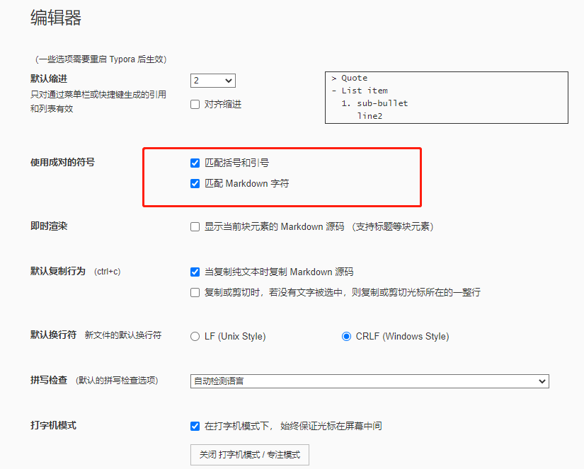

## 电脑初始化设置

### 1. 开机的时候跳过联网

按住shift + Fn + F10调出命令行，然后输入OOBE\BYPASSNRO，重启后在联网界面即出现“我没有Internet连接”选项，点击跳转到下一页继续点击“继续执行受限设置”。剩余步骤按常规操作。

### 2. 设置里需要修改的默认设置

“隐私和安全性”—>windows权限里的下面四项能关掉的都关掉

### 3. 针对磁盘的修改

在D盘新建几个目录：

DevelopEnv：存放编程环境，Python、Java、C++的那些安装包

FileApp：存放各种电脑文件的安装配置文件

FileDocument：存放各种电脑文档

FileDevelop：存在编程文件

FileDownload：存放各种下载的安装包

FileUsers：创建完该目录之后，再分别新建“桌面”、“文档”、“图片”、“下载”、“音乐”、“视频”六个文件夹，然后把快速访问栏里对应的文件位置从C盘分别修改为刚创建的目录位置

### 4. 文件夹选项设置

打开文件资源管理器时打开：选择“此电脑”，隐私里面把三个√取消掉

### 5. 下载的软件

**首先：下载软件后一定要把软件里面的默认文件下载位置改到D盘！！！**

日用软件：QQ、微信、网易云、腾讯会议、百度网盘、

学习软件：XMind、福昕PDF阅读器、小绿鲸、zotero、Typora

开发软件：Python、Java、mingw64、Anaconda、Git、PyCharm、IntelliJ IDEA、VSCode、Xshell、Xftp、

## Typora初始化设置

### 1. 通用

### 2. 外观

> 选GitHub主题

> 点击打开主题文件夹，对github.css文件进行一些设置

### 3. 编辑器

### 4. 图像

### 5. markdown

## 常用插件集合

**Jet Brains插件**

- 提升编程幸福感：

  - smart input

  - Translation

  - Rainbow Brackets

  - CodeGlance Pro

- 编码必备

  - Vue.js：写Vue常用
  - String Manipulation：字符串处理插件

**VS Code插件**

- Colors HIghlight
- CodeSnap
- Markdown all in one
- open in browser
