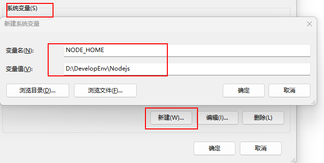

## Nodejs安装操作

### 1. 安装注意事项

1. 将安装路径改到D盘的开发文件夹内
2. 除了修改安装路径，其他一路点击next，保持默认设置，直至安装完成
3. 安装完成后查看安装是否成功？

- 打开cmd，输入`node -v`可查看Nodejs的版本
- 包管理器npm随着Nodejs一起安装至电脑中，通过在cmd输入命令`npm -v`查看npm版本，如果均显示出版本号则代表安装成功

### 2. 安装完Nodejs后需要进行的操作

1. 创建文件夹

   在Nodejs的安装目录下`D:\DevelopEnv\Nodejs`创建两个文件夹node_cache和node_global

2. 修改环境变量

  - 针对用户变量：将Path中刚才安装Nodejs时默认生成的路径`C:\Users\Hishallyi\AppData\Roaming\npm` 修改为刚才创建的【node_global】文件夹的路径`D:\DevelopEnv\Nodejs\node_global`

  - 针对系统变量：在系统变量中新建变量`NODE_HOME`，变量值为安装Nodejs的根目录`D:\DevelopEnv\Nodejs`

    

    然后在系统变量的Path中添加以下三个路径：

    ```
    %NODE_HOME%
    %NODE_HOME%\node_global
    %NODE_HOME%\node_cache
    ```

    以上即完成了环境变量的设置

3. 修改npm相关配置

  > 键盘WIN+R打开输入框，输入`cmd`打开命令提示符

  **修改npm安装包时cache和prefix的默认目录，改为刚创建的两个文件下**
  分别在cmd命令行中输入下面两条命令并回车确认，若没提示则修改成功（可通过`npm config ls`查看配置结果）

  ```
npm config set prefix "D:\DevelopEnv\Nodejs\node_global"
npm config set cache "D:\DevelopEnv\Nodejs\node_cache"
  ```

  查看是否设置成功可以用下面两个命令：

  ```
npm config get prefix
npm config get cache     # 如果对应目录是上面设置的目录那说明就是对的
  ```

  **修改npm安装源，改为国内镜像源**

  在cmd中输入下面命令：

  ```
npm config set registry https://registry.npmmirror.com
  ```

  > 注意：以前的淘宝镜像网站已经不能用了，也就是说不能把源设置为https://registry.npm.taobao.org/，不然安装的时候会报错

4. 在node_global目录下创建文件夹node_modules（如果没有的话），用来存放npm安装的包

### 3. Nodejs常用命令

```python
npm root -g   # 查看利用npm安装包时的默认安装路径
npm config ls # 查看npm配置
npm config ls -l # 查看npm所有配置

# 设置淘宝镜像
npm config set registry https://registry.npmmirror.com
# 查看是否安装成功
npm config get registry
# 安装中国版的包管理器cnpm（如果出现4048错误，可参考https://blog.csdn.net/wzxzRoad/article/details/122766142）
npm install -g cnpm --registry=https://registry.npmmirror.com

# 查看cnpm是否安装成功
cnpm -v

# 查看最根目录安装了哪些包
npm list --depth=0 -global

# 查看当前项目安装了哪些包
npm list

npm -v：# 查看npm安装的版本。
npm init：# 会引导你建立一个package.json文件，包括名称、版本、作者等信息。
npm list：# 查看当前目录下已安装的node包。
npm ls：# 查看当前目录下已安装的node包。
npm install moduleNames：# 安装Node模块到本地目录node_modules下。
npm install < name > -g：# 将包安装到全局环境中。
npm install < name > --save：# 安装的同时，将信息写入package.json中，项目路径中若是有package.json文件时，直接使用npm install方法就能够根据dependencies配置安装全部的依赖包，这样代码提交到git时，就不用提交node_modules这个文件夹了。
npm install < name> --save-dev：# 安装的同时，将信息写入package.json中项目路径中若是有package.json文件时，直接使用npm install方法就能够根据devDependencies配置安装全部的依赖包，这样代码提交到git时，就不用提交node_modules这个文件夹了。
npm uninstall moudleName：# 卸载node模块。
```

### 4. npm安装包的方式：

1. 全局安装在任何文件夹都可运行，原理是写进环境变量，每次在命令行中敲入命令时，根据环境变量的设置寻找对应的可执行程序运行

```python
npm install -g <package_name>
```

2. 局部安装就是在当前项目中建立包，在当前项目中起作用

```python 
npm install <package_name>
```

### 5. npm安装常用包的命令

1. 安装vue

```
npm install -g vue
```

2. 安装vue脚手架

```shell
npm install -g @vue/cli

// 安装指定版本的vue-cli(这个就不用全局安装了)
npm install vue-cli@需要安装的版本号
```

查看所有的vue-cli版本号的命令：`npm  view vue-cli versions --json`