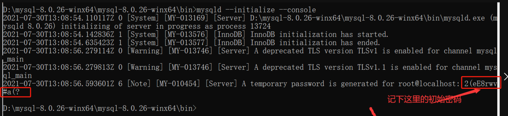
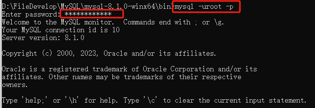

总结MySQL数据库知识

<!-- more -->

## MySQL安装配置

### Windows安装

安装好MySQL数据库之后，进行my.ini初始化文件的配置，创建环境变量，以管理员身份打开命令提示符cmd，进入mysql安装路径的bin目录下

> 管理员身份打开cmd，并在mysql安装目录的bin目录下按顺序执行下面的命令

1. 按照前期配置的my.ini文件，初始化相关配置

```sql
mysqld --initialize --console
```

这一步会随机生成一个默认密码，需要复制保存，以便在稍后启动服务时使用



2. 安装mysql服务

```sql
mysqld --install mysql
```

安装成功会有安装成功的提示

3. 启动mysql服务

```sql
net start mysql
```

4. 登录mysql服务

```sql
mysql -uroot -p
```

登录需要输入密码，输入刚才默认创建的密码，回车之后出现如图提示表示登录成功



5. 修改默认密码

```sql
ALTER USER 'root'@'localhost' IDENTIFIED BY 'chk123';
```

登录到mysql之后，需要修改密码，注意上面命令结尾处的分号不要省略，因为在mysql只能识别语句，不能识别命令，因此每个命令都需要加入分号才能被识别

> 本地密码：chk123

6. 在MySQL安装目录下的my.ini文件中配置MySQL端口号，默认端口号是3306

### Linux安装

参考链接：http://t.csdnimg.cn/PWyoG


## MySQL命令总结

### 常用命令总结

> Windows系统下命令：

- sc query mysql：查看MySQL服务是否启动
- net start/stop mysql：启动/关闭MySQL服务
- mysql -h [主机ip] -u [用户名] -p：远程登录MySQL
- mysql -u [用户名] -p：本地登录MySQL

> Linux系统下命令：

- systemctl status mysql：查看MySQL服务状态
- 

### 启动及关闭 MySQL 服务器

#### Windows 系统下

**启动 MySQL 服务器:**

1、**通过 "服务" 管理工具：** 打开"运行"对话框（Win + R），输入 **services.msc**，找到"MySQL"服务，右击选择"启动"。

2、**通过命令提示符：** 打开命令提示符（以管理员身份），输入以下命令：

```
net start mysql
```

**关闭MySQL服务器:**

1、**通过 "服务" 管理工具：**同样打开"运行"对话框，输入 services.msc，找到 "MySQL" 服务，右击选择"停止"。

2、**通过命令提示符：** 打开命令提示符（以管理员身份），输入以下命令：

```
net stop mysql
```

#### Linux 系统下

**1、启动 MySQL 服务：**

使用 **systemd**命令（适用于大多数现代 Linux 发行版，如 Ubuntu、CentOS 等）：

```
sudo systemctl start mysql
```

使用 **service** 命令（在一些较旧的发行版中）：

```
sudo service mysql start
```

**2、关闭 MySQL 服务：**

**使用 systemd：**

```
sudo systemctl stop mysql
```

使用 service 命令：

```
sudo service mysql stop
```

**3、重启 MySQL 服务：**

**使用 systemd：**

```
sudo systemctl restart mysql
```

使用 service 命令：

```
sudo service mysql restart
```

**4、检查 MySQL 服务状态：**

使用 systemd命令：

```
sudo systemctl status mysql
```

使用 service 命令：

```
sudo service mysql status
```

#### Mac OS 系统

启动 MySQL 服务：

使用命令行：

```
sudo /usr/local/mysql/support-files/mysql.server start
```

关闭 MySQL 服务：

使用命令行：

```
sudo /usr/local/mysql/support-files/mysql.server stop
```

重启 MySQL 服务：

使用命令行：

```
sudo /usr/local/mysql/support-files/mysql.server restart
```

检查 MySQL 服务状态：

使用命令行：

```
sudo /usr/local/mysql/support-files/mysql.server status
```

以上命令中，mysql 可能会因为安装路径或版本的不同而有所变化。

在 Mac OS 中，MySQL 的安装路径通常是 /usr/local/mysql/，因此启动和关闭 MySQL 服务需要使用这个路径下的 mysql.server 脚本。

### 管理MySQL的命令

**登录命令**

```sql
只用用户名登录：mysql -u 用户名 -p
用数据库ip地址登录：mysql -h 主机ip -u 用户名 -p
    -h : 该命令用于指定客户端所要登录的MySQL主机名, 登录当前机器该参数可以省略;
    -u : 所要登录的用户名;
    -p : 告诉服务器将会使用一个密码来登录, 如果所要登录的用户名密码为空, 可以忽略此选项。
    
例如：
mysql -u root -p
然后需要输入用户root设置的密码才能登录成功
```

**退出命令**

在MySQL命令行输入`exit`回车即可退出


> 在登录mysql之后输入的mysql命令，记的加上分号，不然不是一条被识别的mysql语句，就无法别执行
>
> `mysql> mysql语句;`

- **USE \*数据库名\*** :
  选择要操作的Mysql数据库，使用该命令后所有Mysql命令都只针对该数据库。

  ```
  mysql> use RUNOOB;
  Database changed
  ```

- **SHOW DATABASES:**
  列出 MySQL 数据库管理系统的数据库列表。

  ```
  mysql> SHOW DATABASES;
  +--------------------+
  | Database           |
  +--------------------+
  | information_schema |
  | RUNOOB             |
  | cdcol              |
  | mysql              |
  | onethink           |
  | performance_schema |
  | phpmyadmin         |
  | test               |
  | wecenter           |
  | wordpress          |
  +--------------------+
  10 rows in set (0.02 sec)
  ```

- **SHOW TABLES:**
  显示指定数据库的所有表，使用该命令前需要使用 use 命令来选择要操作的数据库。

  ```
  mysql> use RUNOOB;
  Database changed
  mysql> SHOW TABLES;
  +------------------+
  | Tables_in_runoob |
  +------------------+
  | employee_tbl     |
  | runoob_tbl       |
  | tcount_tbl       |
  +------------------+
  3 rows in set (0.00 sec)
  ```

- **SHOW COLUMNS FROM \*数据表\*:**
  显示数据表的属性，属性类型，主键信息 ，是否为 NULL，默认值等其他信息。

  ```
  mysql> SHOW COLUMNS FROM runoob_tbl;
  +-----------------+--------------+------+-----+---------+-------+
  | Field           | Type         | Null | Key | Default | Extra |
  +-----------------+--------------+------+-----+---------+-------+
  | runoob_id       | int(11)      | NO   | PRI | NULL    |       |
  | runoob_title    | varchar(255) | YES  |     | NULL    |       |
  | runoob_author   | varchar(255) | YES  |     | NULL    |       |
  | submission_date | date         | YES  |     | NULL    |       |
  +-----------------+--------------+------+-----+---------+-------+
  4 rows in set (0.01 sec)
  ```

- **SHOW INDEX FROM \*数据表\*:**
  显示数据表的详细索引信息，包括PRIMARY KEY（主键）。

  ```
  mysql> SHOW INDEX FROM runoob_tbl;
  +------------+------------+----------+--------------+-------------+-----------+-------------+----------+--------+------+------------+---------+---------------+
  | Table      | Non_unique | Key_name | Seq_in_index | Column_name | Collation | Cardinality | Sub_part | Packed | Null | Index_type | Comment | Index_comment |
  +------------+------------+----------+--------------+-------------+-----------+-------------+----------+--------+------+------------+---------+---------------+
  | runoob_tbl |          0 | PRIMARY  |            1 | runoob_id   | A         |           2 |     NULL | NULL   |      | BTREE      |         |               |
  +------------+------------+----------+--------------+-------------+-----------+-------------+----------+--------+------+------------+---------+---------------+
  1 row in set (0.00 sec)
  ```

- **SHOW TABLE STATUS [FROM db_name] [LIKE 'pattern'] \G:**
  该命令将输出Mysql数据库管理系统的性能及统计信息。

  ```
  mysql> SHOW TABLE STATUS  FROM RUNOOB;   # 显示数据库 RUNOOB 中所有表的信息
  
  mysql> SHOW TABLE STATUS from RUNOOB LIKE 'runoob%';     # 表名以runoob开头的表的信息
  mysql> SHOW TABLE STATUS from RUNOOB LIKE 'runoob%'\G;   # 加上 \G，查询结果按列打印
  ```
