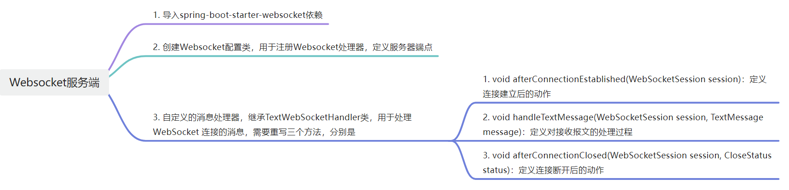
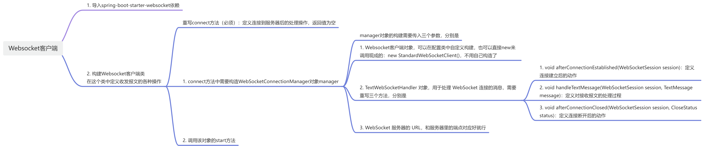

## WebSocket介绍

WebSocket 是一种全双工、持久的网络连接协议，适用于需要双向通信的场景。它在后端服务间的使用较少，但对于实时通讯和流式数据传输，它提供了一种有效的方式。

**优点**：

- 实时：适用于需要实时双向通信的场景。
- 保持持久连接，减少请求和响应的开销。

**缺点**：

- 持久连接会消耗资源，不适合高并发场景。
- 需要额外的管理和调度。

**使用场景**：

- 实时消息推送、实时数据更新（例如：实时交易、游戏、即时通讯系统）。
- 后端服务间实时通信（例如：微服务之间的实时数据同步）。

## WebSocket服务器

### 1. 添加依赖

在pom.xml文件中引入WebSocket依赖

```xml
<dependencies>
    <dependency>
        <groupId>org.springframework.boot</groupId>
        <artifactId>spring-boot-starter-websocket</artifactId>
    </dependency>
</dependencies>
```

### 2. 配置WebSocket

> 创建WebSocket配置类，用于注册WebSocket处理器（服务器）

```java
import org.springframework.context.annotation.Configuration;
import org.springframework.web.socket.config.annotation.EnableWebSocket;
import org.springframework.web.socket.config.annotation.WebSocketConfigurer;
import org.springframework.web.socket.config.annotation.WebSocketHandlerRegistry;

@Configuration
@EnableWebSocket
public class WebSocketConfig implements WebSocketConfigurer {

    /**
     * 注册 WebSocket 处理器
     * @param registry
     */
    @Override
    public void registerWebSocketHandlers(WebSocketHandlerRegistry registry) {
        // 注册 WebSocket 处理器，路径为 /ws
        // MyWebSocketHandler为自定义的消息处理器
        registry.addHandler(new MyWebSocketHandler(), "/ws").setAllowedOrigins("*");
    }
}

```

### 3. 创建WebSocket消息处理器

> 创建用于处理WebSocket消息的处理器
>
> 继承TextWebSocketHandler类，用于处理 WebSocket 连接的消息，需要重写三个方法

```java

```

### 4. 框架图




## WebSocket客户端

### 1. 添加依赖

在pom.xml文件中引入WebSocket依赖

```xml
<dependencies>
    <dependency>
        <groupId>org.springframework.boot</groupId>
        <artifactId>spring-boot-starter-websocket</artifactId>
    </dependency>
</dependencies>
```

### 2. WebSocket客户端配置类

> 创建WebSocket客户端配置类，用于注册一个WebSocket客户端

1. 创建客户端对象`new StandardWebSocketClient()`
2. 将客户端对象传入WebSocket传输类，构造传输对象`new WebSocketTransport()`

3. 用集合方法`Collections.singletonList`将传输对象转化为列表，构建列表对象`transports`；`Collections.singletonList()`方法将创建的`WebSocketTransport`对象包装在一个不可变的单元素列表中，这样做是因为某些 Spring 组件（如 SockJsClient）需要一个`Transport`的列表作为输入。
4. 将传输列表对象作为输入，构建`SockJsClient`对象，作为输入构建WebSocketStompClient对象`new WebSocketStompClient(new SockJsClient(transports))`

完整代码：

```java
@Configuration
public class WebSocketClientConfig {
    @Bean
    public WebSocketStompClient webSocketStompClient() {
        List<Transport> transports = Collections.singletonList(new WebSocketTransport(new StandardWebSocketClient()));
        return new WebSocketStompClient(new SockJsClient(transports));
    }
}
```

### 3. WebSocket客户端

定义`MyWebSocketClient`类，在类中定义了

1. WebSocket服务器的URL地址
2. connect方法，用@PostConstruct注解声明

> **`@PostConstruct`**：这是一个生命周期注解，表示在 Spring 容器初始化 `MyWebSocketClient` 实例之后，`connect()` 方法会被自动调用。用于执行连接 WebSocket 的初始化工作。

3. 在connect方法中，构造`WebSocketConnectionManager`对象，并运行对象的start方法


在`connect`方法中：

- **`@PostConstruct`**：这是一个生命周期注解，表示在 Spring 容器初始化 `MyWebSocketClient` 实例之后，`connect()` 方法会被自动调用。用于执行连接 WebSocket 的初始化工作。

- **`WebSocketConnectionManager`**：这是 Spring WebSocket 框架中用于管理 WebSocket 连接的类。它负责启动和管理 WebSocket 客户端的连接，依赖于一个 `WebSocketHandler` 来处理不同的 WebSocket 事件。

  - 构造函数：
    - `new StandardWebSocketClient()`：用于创建一个标准的 WebSocket 客户端。
    - `new TextWebSocketHandler()`：自定义的 `WebSocketHandler`，用于处理 WebSocket 连接的生命周期和消息传递。

- ```
  构建 WebSocketConnectionManager 对象，传入三个参数，分别是
  1. WebSocket 客户端对象，其实是在配置类中定义的，这里没用，有实现好的客户端类可以直接构造对象
  2. TextWebSocketHandler 对象，用于处理 WebSocket 连接的消息，需要重写三个方法
  3. WebSocket 服务器的 URL
  ```

  

`TextWebSocketHandler` 类：

`TextWebSocketHandler` 是 `WebSocketHandler` 的一个子类，它处理文本消息的收发。重写了三个方法：

1.  **`afterConnectionEstablished(WebSocketSession session)`**：

- 当 WebSocket 连接建立后，该方法会被调用。

2. **`handleTextMessage(WebSocketSession session, TextMessage message)`**：

- 当接收到 WebSocket 服务器发来的文本消息时，会调用这个方法。

3. **`afterConnectionClosed(WebSocketSession session, CloseStatus status)`**：

- 当 WebSocket 连接关闭时会调用这个方法，打印出连接关闭的信息和连接 ID。


`manager.start()`：启动 WebSocket 连接管理器

- `manager.start()` 启动了 `WebSocketConnectionManager`，这会尝试连接到指定的 `WS_URI`（即 WebSocket 服务端）。

### 4. 框架图


