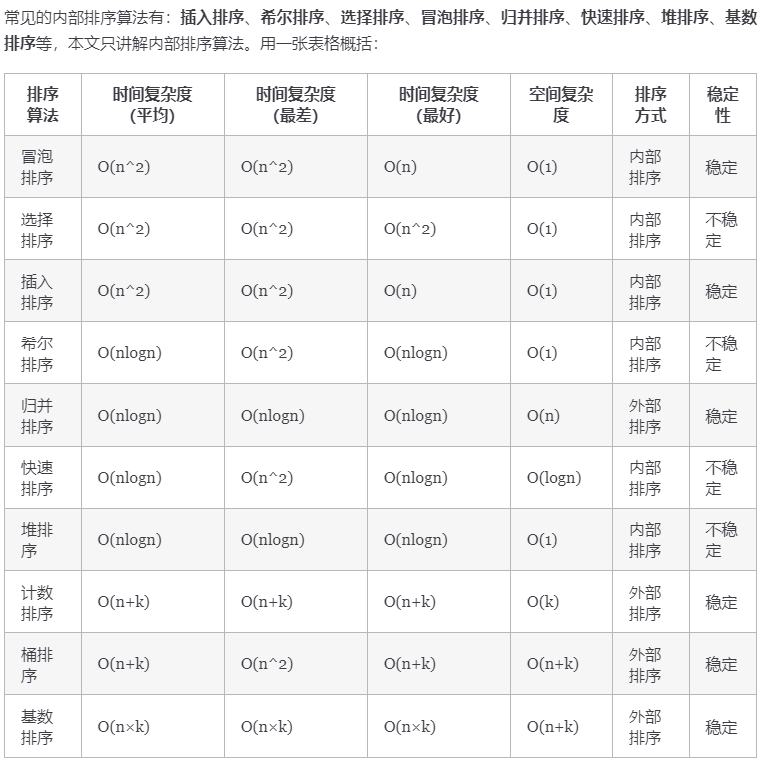
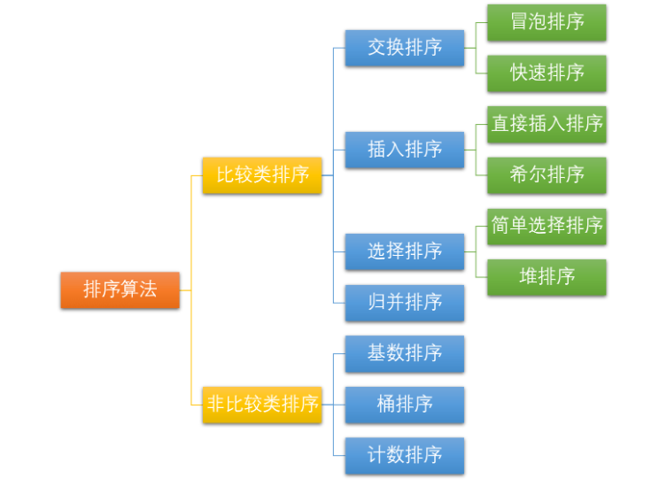

## 简介

> 图源：[十大经典排序算法总结](https://javaguide.cn/cs-basics/algorithms/10-classical-sorting-algorithms.html)



**术语解释**：

- **n**：数据规模，表示待排序的数据量大小。
- **k**：“桶” 的个数，在某些特定的排序算法中（如基数排序、桶排序等），表示分割成的独立的排序区间或类别的数量。
- **内部排序**：所有排序操作都在内存中完成，不需要额外的磁盘或其他存储设备的辅助。这适用于数据量小到足以完全加载到内存中的情况。
- **外部排序**：当数据量过大，不可能全部加载到内存中时使用。外部排序通常涉及到数据的分区处理，部分数据被暂时存储在外部磁盘等存储设备上。
- **稳定**：如果 A 原本在 B 前面，而 $A=B$，排序之后 A 仍然在 B 的前面。
- **不稳定**：如果 A 原本在 B 的前面，而 $A=B$，排序之后 A 可能会出现在 B 的后面。
- **时间复杂度**：定性描述一个算法执行所耗费的时间。
- **空间复杂度**：定性描述一个算法执行所需内存的大小。

**排序算法分类**



## 归并排序（Merge Sort）

```java
public static int[] mergeSort(int[] arr) {
    // 递归的边界条件，若数组为空或长度为1，则直接返回
    if (arr.length <= 1) {
        return arr;
    }

    int middle = arr.length / 2;
    int[] arr1 = Arrays.copyOfRange(arr, 0, middle); // 左半部分
    int[] arr2 = Arrays.copyOfRange(arr, middle, arr.length); // 右半部分

    return merge(mergeSort(arr1), mergeSort(arr2)); // 对两部分递归排序后再合并
}

public static int[] merge(int[] arr1, int[] arr2) {
    // 构造一个存储排序结果的数组
    int[] sorted_arr = new int[arr1.length + arr2.length];
    // 声明指向排序数组、arr1、arr2的指针，都从索引0开始
    int idx = 0, idx1 = 0, idx2 = 0;

    // 合并两个有序数组
    while (idx1 < arr1.length && idx2 < arr2.length) {
        if (arr1[idx1] < arr2[idx2]) {
            sorted_arr[idx++] = arr1[idx1++];
        } else {
            sorted_arr[idx++] = arr2[idx2++];
        }
    }

    // 将 arr1 剩余部分复制到 arr
    while (idx1 < arr1.length) {
        sorted_arr[idx++] = arr1[idx1++];
    }

    // // 将 arr2 剩余部分复制到 arr
    while (idx2 < arr2.length) {
        sorted_arr[idx++] = arr2[idx2++];
    }

    return sorted_arr;
}

```

