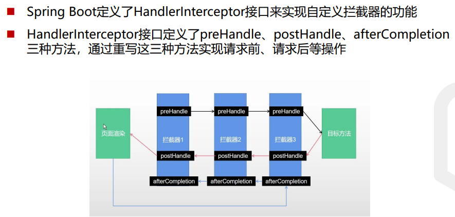
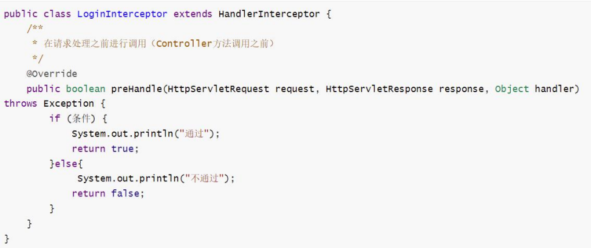
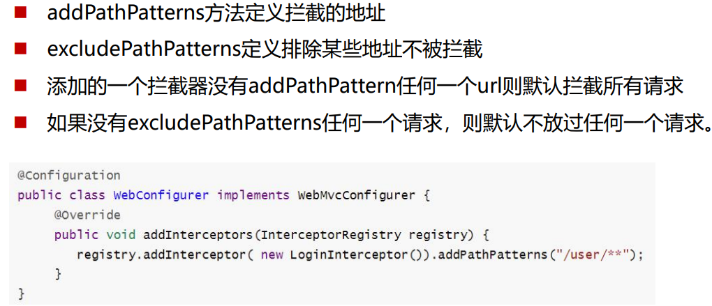
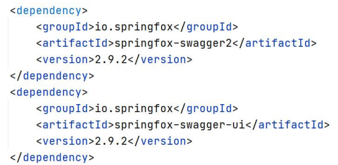
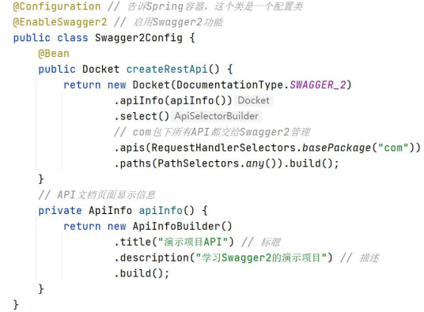
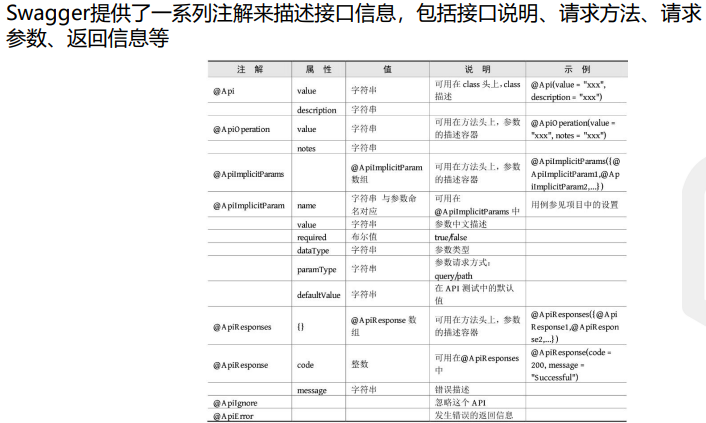

后端学习笔记

<!-- more -->

# SpringBoot

> Bean：Spring Boot中的Bean是指由Spring容器管理的对象。这些Bean通常是应用程序中的各种组件，如服务、存储库、配置类等，它们由Spring容器进行创建、配置和管理。
>
> 在Spring Boot应用程序中，可以通过在类上添加注解（如@Component、@Service、@Repository、@Controller等）来将一个类标记为一个Bean。Spring Boot会自动扫描这些注解，并在启动时将这些类实例化为Bean，然后将它们放入应用程序的上下文中，以便能够进行依赖注入和其他操作。
>
> 总结： 在Spring Boot中，Bean是由Spring容器管理的对象，通过注解标记的类会被Spring容器实例化并放入应用程序上下文中，以便进行依赖注入和其他操作。

## 常用知识

注解

MVC：Model+View+Controller

### 1. 控制器Controller

#### 1. 路由映射

- @RequestMapping
- Method匹配也可以使用@GetMapping、@PostMapping等注解代替

#### 2. 参数传递

- @RequestParam：将请求参数绑定到控制器的方法参数上，接收的参数来自 HTTP请求体或请求url的QueryString，当请求的参数名称与Controller的业务 方法参数名称一致时,@RequestParam可以省略
- @PathVaraible：用来处理动态的URL，URL的值可以作为控制器中处理方法 的参数
- @RequestBody：接收的参数是来自requestBody中，即请求体。一般用于处理 非 Content-Type: application/x-www-form-urlencoded编码格式的数据， 比如：`application/json`、`application/xml`等类型的数据

#### 3. 数据响应

##### 3.1 静态资源访问

使用IDEA创建Spring Boot项目，会默认创建出classpath:/static/目录，静态 资源一般放在这个目录下即可。

如果默认的静态资源过滤策略不能满足开发需求，也可以自定义静态资源过滤 策略。

在application.properties中直接定义过滤规则和静态资源位置： 

```java
spring.mvc.static-path-pattern=/static/**
spring.web.resources.static-locations=classpath:/static/
```

过滤规则为/static/**，静态资源位置为classpath:/static/

##### 3.2 SpringBoot实现文件上传功能

Spring Boot工程嵌入的tomcat限制了请求的文件大小，每个文件的配置最大 为1Mb，单次请求的文件的总数不能大于10Mb。

要更改这个默认值需要在配置文件（如application.properties）中加入两个配 置

```java
spring.servlet.multipart.max-file-size=10MB
spring.servlet.multipart.max-request-size=10MB
```

##### 3.3 拦截器

拦截器在Web系统中非常常见，对于某些全局统一的操作，我们可以把它提取 到拦截器中实现。总结起来，拦截器大致有以下几种使用场景：

权限检查：如登录检测，进入处理程序检测是否登录，如果没有，则直接返回 登录页面。

性能监控：有时系统在某段时间莫名其妙很慢，可以通过拦截器在进入处理程 序之前记录开始时间，在处理完后记录结束时间，从而得到该请求的处理时间

通用行为：读取cookie得到用户信息并将用户对象放入请求，从而方便后续流 程使用，还有提取Locale、Theme信息等，只要是多个处理程序都需要的，即 可使用拦截器实现。



- 拦截器定义



- 拦截器注册



### 2. Swagger

> 什么是Swagger

Swagger是一个规范和完整的框架，用于生成、描述、调用和可视化RESTful风 格的Web服务，是非常流行的API表达工具。

Swagger能够自动生成完善的RESTful API文档，，同时并根据后台代码的修改 同步更新，同时提供完整的测试页面来调试API。

#### 使用Swagger自动生成Web API文档

在Spring Boot项目中集成Swagger同样非常简单，只需在项目中引入 springfox-swagger2和springfox-swagger-ui依赖即可



```xml

```

#### 配置Swagger



#### 注意事项

Spring Boot 2.6.X后与Swagger有版本冲突问题，需要在 application.properties中加入以下配置：

```xml
spring.mvc.pathmatch.matching-strategy=ant_path_matcher
```

#### 使用Swagger进行接口测试

启动项目访问 http://127.0.0.1:8080/swagger-ui.html ，即可打开自动生成的 可视化测试页面

#### Swagger常用注解



## 开发环境热部署

1. 在pom.xml配置文件中添加dev-tools依赖

> 使用optional=true表示依赖不会传递，即该项目依赖devtools；其他项目如 果引入此项目生成的JAR包，则不会包含devtools

```xml
<dependency>
    <groupId>org.springframework.boot</groupId>
    <artifactId>spring-boot-devtools</artifactId>
    <optional>true</optional>
</dependency>
```

2. 在application.properties中配置devtools

添加如下代码：

```java
// 热部署生效
spring.devtools.restart.enabled=true
// 设置重启目录
spring.devtools.restart.additional-paths=src/main/java
// 设置classpath目录下的WEB-INF文件夹内容修改下不重启
spring.devtools.restart.exclude=static/**
```

3. IDEA设置

- 打开Settings页面，在左边的菜单栏依次找到 Build,Execution,Deployment→Compile，勾选Build project automatically
- 新版本IDEA：在Setting页面，在左边的菜单栏找到Advanced ，勾选 Allow auto-make to start even if developed application is currently running复选框
- 老版本IDEA：按Ctrl+Shift+Alt+/快捷键调出Maintenance页面，单击Registry，勾选compile.automake.allow.when.app.running复选框。
- 做完这两步配置之后，若开发者再次在IntelliJ IDEA中修改代码，则项目会自动 重启

## 系统配置

项目创建成功后会默认在resources目录下生成application.properties文件。 该文件包含Spring Boot项目的全局配置

## Mybatis

### 调用XML文件中的SQL命令

在Spring Boot项目中，针对数据库的增删改查操作通常使用MyBatis等持久化框架来管理。而MyBatis通常会使用XML文件来封装SQL语句。你可以通过以下步骤来调用XML文件中的SQL命令：

1. **定义Mapper接口：** 首先，你需要定义一个Mapper接口，用于声明要调用的SQL语句。Mapper接口中的方法名称和XML文件中的SQL语句的ID相对应。

```java
public interface UserMapper {
    User findById(Long id); // 方法名对应XML中的SQL语句的ID
}
```

2. **编写XML文件：** 接下来，你需要编写一个XML文件，用于定义SQL语句。在XML文件中，你可以定义增删改查等各种操作的SQL语句，并通过`<select>`、`<insert>`、`<update>`、`<delete>`等标签来标识不同类型的SQL操作。

```xml
<!-- UserMapper.xml -->
<mapper namespace="com.example.mapper.UserMapper">
    <select id="findById" resultType="com.example.entity.User">
        SELECT * FROM users WHERE id = #{id}
    </select>
</mapper>
```

3. **配置Mapper接口和XML文件：** 在Spring Boot的配置文件中，你需要配置MyBatis来扫描Mapper接口和XML文件，并将它们关联起来。

```yaml
# application.yaml
mybatis:
  mapper-locations: classpath:com/example/mapper/*.xml
```

4. **调用Mapper接口：** 最后，在需要使用SQL语句的地方，你可以注入Mapper接口的实例，并调用接口中定义的方法来执行相应的SQL操作。

```java
@Autowired
private UserMapper userMapper;

public User findUserById(Long id) {
    return userMapper.findById(id);
}
```

通过以上步骤，你就可以在代码中调用XML文件中定义的SQL命令了。在实际应用中，你可以根据需要编写更多的SQL语句，并在Mapper接口中定义对应的方法，从而实现各种数据库操作。

### 常用用法和设置

MyBatis 是一个优秀的持久层框架，在开发过程中常用的用法和设置有很多，以下列举了一些常见的用法和设置：

1. **XML映射文件：** 使用 XML 文件来定义 SQL 映射，其中包含了 SQL 语句以及参数映射、结果映射等信息。

```xml
<mapper namespace="com.example.mapper.UserMapper">
    <select id="findById" resultType="com.example.entity.User">
        SELECT * FROM users WHERE id = #{id}
    </select>
</mapper>
```

2. **注解方式：** 除了 XML 文件外，还可以使用注解的方式来定义 SQL 映射，通过在方法上添加注解的方式来定义 SQL 语句。

```java
@Mapper
public interface UserMapper {
    @Select("SELECT * FROM users WHERE id = #{id}")
    User findById(Long id);
}
```

3. **动态 SQL：** MyBatis 提供了一套强大的动态 SQL 功能，可以在 SQL 中进行条件判断、循环等操作。

```xml
<select id="findByCondition" resultType="com.example.entity.User">
    SELECT * FROM users
    <where>
        <if test="name != null and name != ''">
            AND name = #{name}
        </if>
        <if test="age != null">
            AND age = #{age}
        </if>
    </where>
</select>
```

4. **参数映射：** MyBatis 支持多种参数映射方式，包括单个参数、多个参数、Map 参数、对象参数等。

```xml
<select id="findByCondition" resultType="com.example.entity.User">
    SELECT * FROM users WHERE name = #{name} AND age = #{age}
</select>
```

5. **结果映射：** MyBatis 支持将查询结果映射为 Java 对象，可以通过属性名、别名、构造函数等方式进行结果映射。

```xml
<resultMap id="userResultMap" type="com.example.entity.User">
    <id property="id" column="user_id"/>
    <result property="name" column="user_name"/>
    <result property="age" column="user_age"/>
</resultMap>
```

6. **缓存：** MyBatis 支持一级缓存和二级缓存，可以提高查询性能。

```xml
<cache eviction="LRU" flushInterval="60000" size="512" readOnly="true"/>
```

7. **插件：** MyBatis 支持自定义插件，在 SQL 执行前后进行一些额外的操作，如日志记录、性能监控等。

```java
@Intercepts({
    @Signature(type = Executor.class, method = "update", args = {MappedStatement.class, Object.class})
})
public class ExamplePlugin implements Interceptor {
    // 实现拦截逻辑
}
```

8. **动态数据源：** MyBatis 支持动态切换数据源，可以根据不同的场景选择不同的数据源。

```java
public class DynamicDataSource extends AbstractRoutingDataSource {
    // 实现动态数据源的切换逻辑
}
```

这些是 MyBatis 开发过程中常用的一些用法和设置，能够帮助开发人员更加灵活地使用 MyBatis 来操作数据库。


# IDEA常用快捷键

## 1. 快速生成基本函数

生成getter、构造函数、重写toString函数的快捷键

在IntelliJ IDEA中，可以使用以下快捷键快速生成构造方法、getter方法等：

1. **生成构造方法：** 在类的任何位置，例如类的开头或者类的内部，输入`Alt + Insert`（Windows/Linux）或者`Cmd + N`（Mac），然后选择 "Constructor"，按下回车键。

2. **生成Getter和Setter方法：** 同样在类的任何位置，输入`Alt + Insert`（Windows/Linux）或者`Cmd + N`（Mac），然后选择 "Getter and Setter"，按下回车键。

这些快捷键会在代码中自动生成相应的构造方法、getter和setter方法，并根据类中的字段进行适当的生成。

## 2. 快速生成main函数

在IntelliJ IDEA中，可以使用以下快捷键快速生成main方法：

1. 在类的任何位置，例如类的开头或者类的内部，输入`psvm`，然后按下`Tab`键。

这个快捷键会自动补全为：

```java
public static void main(String[] args) {
    
}
```

这样你就可以直接在`main`方法中编写代码了。

## 3. 快速生成多行注释

在IntelliJ IDEA中，快速生成多行注释的快捷键是 `Ctrl + Shift + /`（Windows/Linux）或者 `Cmd + Shift + /`（Mac）。这个快捷键会在当前光标位置插入多行注释。

如果想要在一个函数前添加多行注释并快速生成函数参数的多行注释，可以按照以下步骤：

1. 将光标放置在函数定义的上方，即函数的第一行。
2. 使用快捷键 `Ctrl + Shift + /`（Windows/Linux）或者 `Cmd + Shift + /`（Mac）插入多行注释。
3. **在多行注释中，使用 `/**` 开始，并按下回车键。**
4. IntelliJ IDEA会自动生成多行注释的模板，并在模板中包含了函数的参数信息，可以根据需要修改参数说明。
5. 编写完毕后，按下回车键即可。

这样就可以快速生成函数参数的多行注释了。

## 4. 快速生成print语句

输入`sout`，然后回车即可快速生成


# 开发知识

## POLO及其转换-PO、DO、DTO、VO

[资料链接](https://zhuanlan.zhihu.com/p/94931336)

### 概念

**DTO(Data Transfer Object)**：数据传输对象,原先是为分布式提供粗粒度的数据实体，减少调用次数来提升性能和降低网络压力。

**VO(view object)**：可视层对象，用于给前端显示的对象。(只传递有需要的参数以保障数据安全)

**DO(Domain Object)**：领域对象，一般和数据中的表结构对应。

**PO(Persistent Object)**：持久化对象,是一种 o/r 映射关系，可以看成是数据库表到java对象的映射。

### **概括**

**DTO**:前端给后端传递的数据

**VO**:后端给前端传递的数据

**DO**:数据库表结构

**PO**:数据库表结构到JAVA的映射类

一般我们使用Mybatis建的类为PO,控制器接受到前端发来的参数为DTO,给前端发送的安全的数据为VO。如果数据类不做映射处理关系时PO=DO


## 知识点汇总

1. 线程信息BaseContext：客户端发起的每一次请求都会是一个单独的线程，因此可以使用LocalThread存储每次线程中的信息

2. Web全局配置类WebMvcConfigration：在全局的配置类里进行注册（自定义方法），这些全局的配置包括：

   - 自定拦截器——在拦截器中设置固定请求路径的jwt令牌校验

     > 在进行jwt令牌校验时会解析当前登录用户的Token，获取登录用户ID并存储到LocalThread中进行保存，这样便可即时获取当前登录用户的ID

   - 通过knife4j生成接口文档

   - 设置静态资源映射

   - 扩展消息转换器——对Java对象进行序列化处理（转换为JSON对象）

3. 全局异常处理器Handler：针对后端报错而前端无法提示的情况，在后端设置异常处理器，对异常信息进行封装并传递给前端进行提示

4. jwt令牌校验拦截器JwtTokenAdminInterpreter：获取用户登录的令牌并校验，来决定是否放行

5. 将后端返回对象统一封装在包result中，用泛型增强可用性，操作结果封装为Result类，分页查询结果封装为PageResult

6. 将常量类存统一放在包constant下，分为MessageConstant、StatusConstant、PasswordConstant、JwtClaimsConstant等

7. 将异常捕获信息统一放在包exception下


## AOP

AOP（面向切面编程）是一种编程范例，它允许开发者定义和使用横切关注点（cross-cutting concerns）。

横切关注点是指影响应用程序多个部分的功能，比如日志记录、事务管理、性能统计等。这些功能与应用程序的核心业务逻辑部分相对独立，但却会影响到多个模块。

AOP 的主要思想是将这些横切关注点从原始模块中分离出来，形成切面（aspect）。切面是横切关注点的模块化体现，它可以定义在多个模块中共享的行为，并将这些行为与核心业务逻辑解耦。

AOP 的实现通常是通过在特定的切入点（join point）上执行特定的动作（advice）。切入点通常是在应用程序的执行过程中可以插入切面的地方，比如方法执行前、方法执行后等。而动作通常包括在切入点处执行的代码逻辑，比如日志记录、事务管理等。

Spring 框架提供了强大的 AOP 支持，可以通过声明式的方式来定义切面，并将其与应用程序的核心业务逻辑进行结合。

以下是一个简单的 Java AOP 示例，使用 Spring 框架的 AOP 功能来实现方法执行前后的日志记录：

```java
import org.aspectj.lang.annotation.Aspect;
import org.aspectj.lang.annotation.Before;
import org.aspectj.lang.annotation.After;
import org.aspectj.lang.ProceedingJoinPoint;

@Aspect
public class LoggingAspect {

    @Before("execution(* com.example.service.*.*(..))")
    public void logBefore() {
        System.out.println("Before executing the method");
    }

    @After("execution(* com.example.service.*.*(..))")
    public void logAfter() {
        System.out.println("After executing the method");
    }
}

public class MyService {

    public void doSomething() {
        // 执行核心业务逻辑
    }
}
```

在这个示例中，LoggingAspect 类定义了两个切面，分别在 MyService 类的方法执行前后执行日志记录的动作。


# 注解汇总


## Java原生注解

### @Override

`@Override` 是 Java 中的一个注解，它用于标识一个方法是覆盖（重写）父类的方法。当一个方法添加了 `@Override` 注解时，编译器会检查该方法是否真的覆盖了父类中的一个方法，如果没有，则会报编译错误。

该注解通常用于增加代码的可读性和可维护性，因为它能够明确地表明一个方法是在覆盖父类的方法。这有助于其他开发者更容易地理解代码结构和继承关系。

总结： `@Override` 注解用于标识一个方法是在覆盖父类的方法，以增加代码的可读性和可维护性。


## Spring框架注解

### @Autowired：自动装配

`@Autowired` 是 Spring Framework 中的一个注解，用于自动装配Bean。当一个类上标注了`@Autowired`注解时，Spring容器会在上下文（Context）中寻找匹配的Bean，并自动注入到需要的地方。这样可以简化代码，避免显式地进行Bean的实例化和依赖注入。

在给定的代码中，`@Autowired` 注解用于标记 `EmployeeService` 和 `JwtProperties` 两个类的实例化，这样在`EmployeeController`类中就可以直接使用这两个实例，而不需要手动创建它们。

总结：`@Autowired` 注解用于自动装配Bean，简化了bean的实例化和依赖注入。

### @Component

`@Component` 是 Spring Framework 中的注解，它用于标识一个类作为 Spring 组件，并由 Spring 运行时管理。被标记为 `@Component` 的类将被自动检测并注册为 Spring 应用程序上下文中的 Bean。这意味着可以在其他组件中自动注入该类的实例，并且可以通过 Spring 上下文进行管理。

这个注解通常用于将业务逻辑、持久性实体、服务等标记为 Spring 管理的组件。

总结：`@Component` 的主要功能是标识一个类为 Spring 组件，并将其纳入 Spring 的管理和依赖注入体系中。

> `@Component` 和 `@Autowired` 注解是 Spring 框架中常用的注解，用于实现依赖注入和组件扫描。它们之间的区别在于它们的作用和使用场景。
>
> ### @Component 注解
>
> `@Component` 注解是 Spring 框架中最通用的注解之一，用于标识一个类为 Spring 组件。通常用于将类标记为受 Spring 管理的 bean，并且让 Spring 自动扫描和识别这些组件。这样可以在其他地方通过依赖注入的方式使用这些组件。
>
> 示例：
>
> ```java
> @Component
> public class MyClass {
> // Class body
> }
> ```
>
> ### @Autowired 注解
>
> `@Autowired` 注解用于自动装配被 `@Component` 或其他特定注解标记的 Spring bean，并且通常用于实现依赖注入。通过 `@Autowired` 注解，我们可以告诉 Spring 在需要某个类型的 bean 时，自动将合适的实例注入进来。
>
> 示例：
>
> ```java
> @Component
> public class MyOtherClass {
> @Autowired
> private MyClass myClass;
> // Class body
> }
> ```
>
> ### 区别
>
> - `@Component` 用于标识一个类为 Spring 组件，让 Spring 可以识别和管理这些组件。
> - `@Autowired` 用于自动装配标记为 `@Component` 的 Spring bean，实现依赖注入。
>
> 需要注意的是，`@Autowired` 注解通常与 `@Component` 注解一起使用，以实现依赖注入，但它也可以与其他一些标记为 `@Component` 的特定注解一起使用，例如 `@Service`、`@Repository` 等。

### @ExceptionHandler

`@ExceptionHandler` 是Spring Framework中的一个注解，用于声明一个方法是一个异常处理器。当一个控制器中的方法抛出了特定类型的异常时，被`@ExceptionHandler`注解所标记的方法将会被调用来处理这个异常。

具体来说，`@ExceptionHandler`注解可以在`@Controller`或`@RestController`类中的方法上使用。标记的方法必须返回一个用于表示错误或异常信息的对象，例如`ResponseEntity`或简单的对象类型。

这样的注解提供了一种集中管理和处理异常情况的方法，让开发人员能够更容易地对不同种类的异常进行处理。

总结：`@ExceptionHandler` 注解用于声明一个方法是一个异常处理器，在控制器中用于捕获特定类型的异常并进行处理。

### @RestControllerAdvice

`@RestControllerAdvice` 是一个注解，用于定义一个全局性的异常处理器。当使用 Spring MVC 或 Spring WebFlux 进行开发时，可以使用 `@RestControllerAdvice` 注解来定义一个统一的异常处理类，用于捕获处理在控制器中抛出的异常。

这个注解通常与 `@ExceptionHandler` 注解一起使用，用于指定处理特定异常的方法。通过 `@ExceptionHandler` 注解，您可以定义一个或多个方法来处理特定类型的异常，从而实现全局的异常处理。

总结：`@RestControllerAdvice` 注解用于定义全局异常处理器，可以通过 `@ExceptionHandler` 注解来指定处理特定异常的方法。


## Mybatis相关注解

### @Mapper

`@Mapper` 是一个注解，通常用于标识一个接口为 MyBatis 的映射器接口。在这种情况下，被注解的接口将由 MyBatis 框架自动创建其实现类。

这个注解告诉 MyBatis 在运行时为这个接口创建一个代理对象，以便使用 SQL 查询数据库，并将查询结果映射到 Java 对象上。

当应用程序需要与数据库交互时，`@Mapper` 注解的接口将负责定义数据库操作的方法。

代码总结： `@Mapper` 注解标识了这个接口为 MyBatis 的映射器接口，它将由 MyBatis 框架自动创建其实现类。主要功能是定义数据库操作的方法，以便在应用程序中与数据库进行交互。


## Lombok库注解

### @Data

这个注解是 Lombok 提供的，用于自动生成类中的常规方法，如 `equals()`, `hashCode()`, `toString()` 等。通过在类上添加 `@Data` 注解，Lombok 将会自动生成这些常规方法，使代码更加简洁。

### @Slf4j@

`@Slf4j`是Lombok库中的一个注解，用于日志记录。它会在类中生成一个名为`log`的日志记录器字段，这样你就可以在类内部使用它来记录日志，而无需显式实例化一个日志记录器对象。这简化了向代码中添加日志记录语句的过程。实际的日志记录输出取决于所使用的底层日志记录框架，比如Log4j或Logback。

总结代码：

- `@Slf4j`注解用于自动生成一个名为`log`的日志记录器字段。
- 这个日志记录器被用于在`EmployeeController`类的不同部分记录日志，有助于调试、监控和理解应用程序的流程。

总的来说，给定代码中`@Slf4j`注解的主要目的是通过自动生成一个日志记录器字段，启用`EmployeeController`类内的日志记录，从而有助于跟踪类的行为，帮助调试和监控与员工管理相关的活动。


## Controller相关注解

### @RestController

> 标识一个类是控制器，然后才可以在下面指定前端的请求路径，在RequestMapping指定路径前缀，PostMapping/GetMapping中指定特定的函数路径

`@RestController` 是一个 Spring 框架提供的注解，它被**用来标识一个类，表示这个类是一个 RESTful 服务的控制器**。在 Spring MVC 应用中，使用 `@RestController` 注解的类将会自动将其返回的对象转换为 JSON 或 XML 响应，从而作为 HTTP 响应发送给客户端。

它的主要目的是简化 RESTful 服务的开发，并且相比传统的`@Controller` 注解，不需要在每个方法上使用 `@ResponseBody` 注解来指示返回数据值。

此注解表明类的实例将用作 RESTful 服务的控制器，并负责处理传入的 HTTP 请求，以及生成对应的 HTTP 响应数据。

总结：`@RestController` 注解用于标识一个类，表示这个类是一个 RESTful 服务的控制器，简化了 RESTful 服务的开发，不需要在每个方法上使用 `@ResponseBody` 注解。

### @PathVariable

> 意思就是说当前端传入路径中包含需要的信息时，需要用这个注解把URL中的变量绑定到函数的形参中

`@PathVariable`注解用于Spring框架中的控制器方法中，它用于将URL模板中的变量绑定到方法的参数上。

当使用`@PathVariable`注解时，Spring框架将根据变量名将URL模板中对应的值注入到方法的参数中，以便在方法体内使用。


## Mapping相关注解

Spring MVC是一个用于构建Web应用程序的开源框架，它提供了一种灵活且强大的方式来创建基于Java的Web应用程序。其中，Mapping注解用于将HTTP请求映射到相应的处理方法上。Spring MVC提供了多种Mapping注解，以下是它们的详细介绍：

@GetMapping、PostMapping、PutMapping、DeleteMapping、PatchMapping

1. `@RequestMapping`: `@RequestMapping` 是最常用的Mapping注解，用于将HTTP请求映射到指定的处理方法上。它支持多种属性，如`value`、`method`、`params`和`headers`，用于定义不同的映射条件。例如：

   ```java
   @Controller
   public class MyController {
       @RequestMapping(value = "/hello", method = RequestMethod.GET)
       public String sayHello() {
           return "hello";
       }
   }
   ```

2. `@GetMapping`、`@PostMapping`、`@PutMapping`、`@DeleteMapping`、`@PatchMapping`: 这些注解是`@RequestMapping`的快捷方式，用于分别将HTTP的GET、POST、PUT、DELETE和PATCH请求映射到处理方法上。例如：

   ```java
   @Controller
   public class MyController {
       @GetMapping("/hello")
       public String sayHello() {
           return "hello";
       }
   }
   
   @Controller
   public class MyController {
       @PostMapping("/create")
       public String create() {
           return "created";
       }
   }
   ```

3. `@RequestParam`: `@RequestParam` 用于将HTTP请求中的参数映射到处理方法的参数上。可以指定参数名、是否必须、默认值等属性。例如：

   ```java
   @Controller
   public class MyController {
       @GetMapping("/user")
       public String getUser(@RequestParam("id") Long userId) {
           // 使用userId参数
           return "user";
       }
   }
   ```

4. `@PathVariable`: `@PathVariable` 用于将URL中的占位符部分映射到处理方法的参数上。例如：

   ```java
   @Controller
   public class MyController {
       @GetMapping("/user/{id}")
       public String getUser(@PathVariable("id") Long userId) {
           // 使用userId参数
           return "user";
       }
   }
   ```

5. `@RequestHeader`: `@RequestHeader` 用于将HTTP请求的头部信息映射到处理方法的参数上。例如：

   ```java
   @Controller
   public class MyController {
       @GetMapping("/user-agent")
       public String getUserAgent(@RequestHeader("User-Agent") String userAgent) {
           // 使用userAgent参数
           return "user-agent";
       }
   }
   ```

通过使用这些Mapping注解，可以方便地定义Spring MVC中的请求映射关系，使得Web应用程序的处理方法更加清晰和易于维护。

### @RequestMapping

`@RequestMapping` 是 Spring MVC 提供的一个注解，它用于将 HTTP 请求映射到 MVC 和 REST 控制器的处理方法。它可以用在类级别或方法级别。

类级别的 `@RequestMapping` 注解指定了该控制器中所有请求处理方法的基本 URL 路径。在这个例子中，类级别的 `@RequestMapping("/admin/employee")` 指定了所有请求处理方法的基本 URL 路径为 "/admin/employee"。

方法级别的 `@RequestMapping` 注解则用于将特定的 HTTP 请求映射到对应的处理方法。在该例子中，`@PostMapping("/login")` 和 `@PostMapping("/logout")` 分别将 HTTP POST 请求映射到 `login()` 和 `logout()` 方法。

总结： `@RequestMapping` 注解用于将 HTTP 请求映射到控制器处理方法，可以用在类级别或方法级别。

**类级别**的 `@RequestMapping("/admin/employee")` 指定了基本 URL 路径

**方法级别**的 `@PostMapping("/login")` 和 `@PostMapping("/logout")` 分别映射了 HTTP POST 请求到对应的处理方法。

### @RequestBody

`@RequestBody` 是Spring框架中用来**绑定 HTTP 请求体到方法参数的注解**。当一个请求被发送到一个处理方法时，Spring会尝试将请求的内容映射到被 `@RequestBody` 注解标注的方法参数上。这个注解通常用于处理 POST 请求，将请求体中的数据绑定到方法参数上，以便后续处理。

这个注解在上下文中的代码中被使用在 `login` 方法的 `employeeLoginDTO` 参数上。它指示Spring将请求体中的数据绑定到这个参数对象上，这样在 `login` 方法中就可以直接使用这个对象来处理请求中的数据。

总结：`@RequestBody` 注解用于绑定 HTTP 请求体到方法参数，在这个代码中用于将 POST 请求中的数据绑定到 `login` 方法的 `employeeLoginDTO` 参数上，以便后续处理员工登录操作。


## Swagger相关注解

### @Api

用在Controller层中，针对`类`进行解释

### @ApiOperation

用在Controller层中，针对`类方法`进行解释

### @ApiModel

用在DTO层中，针对`类`进行解释

`@ApiModel(description = "员工登录时传递的数据模型")` 注解： 这个注解来自于 Swagger，用于对类进行说明和描述。在这里，它描述了 EmployeeLoginDTO 类，指明其用途是用于员工登录时传递的数据模型。

### @ApiModelProperty

用在DTO层中，针对`类属性`进行解释

字段/属性注解，Swagger来描述类的属性变量


## 异常相关注解

### @ExceptionHandler

`@ExceptionHandler`是Spring框架中用于处理异常的注解。它是用在方法上的注解，用于指示一个特定的方法可以处理特定类型的异常。当被注解的方法捕获到对应的异常类型时，将会被调用来处理该异常。

这个注解可以出现在Controller中的方法上，也可以出现在全局异常处理器（如上下文中的 `GlobalExceptionHandler` 类）中的方法上。

总结：`@ExceptionHandler`用于标识一个方法可以处理特定类型的异常，被用于全局异常处理器中的方法，以提供对特定类型异常的处理逻辑。


# Java语法

## 泛型

Java泛型是一种在编译时进行类型检查和类型安全的机制，它允许在类、接口、方法等中使用参数化类型。泛型的引入使得代码更加灵活、可重用，并提高了代码的安全性。

### 泛型语法和机制：

1. **泛型类（Generic Class）：** 泛型类是指**具有一个或多个类型参数的类**。类型参数在类名后用尖括号`<>`括起来，并在类的定义中使用。例如：

```java
public class MyGenericClass<T> {
    private T value;

    public void setValue(T value) {
        this.value = value;
    }

    public T getValue() {
        return value;
    }
}
```

2. **泛型方法（Generic Method）：** 泛型方法是指在方法声明中带有类型参数的方法。类型参数可以在方法的返回类型前面声明，并在方法体中使用。例如：

```java
public <T> T myGenericMethod(T value) {
    return value;
}
```

3. **泛型接口（Generic Interface）：** 泛型接口是指具有一个或多个类型参数的接口。类型参数在接口名后用尖括号`<>`括起来，并在接口的定义中使用。例如：

```java
public interface MyGenericInterface<T> {
    T getValue();
    void setValue(T value);
}
```

4. **通配符（Wildcard）：** 通配符用于表示泛型类型的一种不确定类型。`?`表示未知类型，可以用在声明、实例化和方法调用中。例如：

```java
List<?> myList; // 声明一个未知类型的List
```

5. **限定通配符（Bounded Wildcard）：** 限定通配符用于限制泛型类型的范围。`<? extends T>`表示某个未知类型，必须是`T`或者`T`的子类型；`<? super T>`表示某个未知类型，必须是`T`或者`T`的父类型。

### 泛型原理：

Java泛型的实现是通过**类型擦除（Type Erasure）**来实现的。在编译时，所有的**泛型类型都会被擦除为它们的上界（对于没有指定上界的类型，使用`Object`作为上界），并插入必要的类型转换以保持类型安全**。这意味着在运行时，泛型类型信息是不可用的，只有在编译时才会进行类型检查。

### 自定义泛型示例：

```java
public class Pair<T, U> {
    private T first;
    private U second;

    public Pair(T first, U second) {
        this.first = first;
        this.second = second;
    }

    public T getFirst() {
        return first;
    }

    public void setFirst(T first) {
        this.first = first;
    }

    public U getSecond() {
        return second;
    }

    public void setSecond(U second) {
        this.second = second;
    }

    public static void main(String[] args) {
        Pair<String, Integer> pair = new Pair<>("Hello", 123);
        String first = pair.getFirst(); // 获取第一个元素
        Integer second = pair.getSecond(); // 获取第二个元素
        System.out.println("First: " + first + ", Second: " + second);
    }
}
```

在上面的示例中，我们定义了一个泛型类`Pair`，它有两个类型参数`T`和`U`，表示一对值的类型。通过使用泛型，我们可以**在创建`Pair`对象时指定不同类型的元素，并且在使用时编译器会进行类型检查，确保类型的一致性和安全性。**


## 详解Java注解机制

### 详解

Java注解（Annotation）是一种元数据，它提供了关于程序代码其他部分的信息。它们可以在类、方法、变量等元素上声明，用于提供额外的信息，而这些信息可以被编译器、解释器或者其他工具读取和利用。注解以`@`符号开始，后跟注解的名称和一对括号，括号中可以包含一些参数。

Java注解机制的关键点如下：

1. **声明注解：** 注解的声明使用 `@interface` 关键字，类似于接口的声明。可以在注解中定义一些元素，这些元素在使用时需要提供值。例如：

```java
public @interface MyAnnotation {
    String value();
}
```

2. **内置注解：** Java提供了一些内置的注解，例如 `@Override`、`@Deprecated`、`@SuppressWarnings` 等，它们在编写代码时能够提供一些额外的信息或者告诉编译器执行一些特定的行为。

3. **元注解：** 元注解是可以应用到其他注解上的注解，用来指定注解如何使用。Java中有几种内置的元注解，例如 `@Target`、`@Retention`、`@Documented`、`@Inherited` 等，它们用于控制注解的作用范围、保留策略、文档生成等。

4. **使用注解：** 使用注解时，将注解放在目标元素的前面。例如，在类、方法、变量上使用注解：

```java
@MyAnnotation("SomeValue")
public class MyClass {

    @MyAnnotation("MethodValue")
    public void myMethod() {
        // Method body
    }

    @MyAnnotation("FieldValue")
    private String myField;

}
```

5. **解析注解：** 使用Java反射机制可以在运行时解析注解，并根据注解中的信息做相应的处理。可以获取类、方法、字段等上的注解，并根据注解的信息进行业务逻辑的处理。

6. **自定义注解处理器：** 可以通过自定义注解处理器，对代码中的注解进行处理，生成一些辅助代码或者进行其他操作。Java提供了 `javax.annotation.processing` 包来支持自定义注解处理器的开发。

总的来说，Java注解机制提供了一种优雅的方式来为代码添加元数据，可以用于提供配置信息、在编译时进行检查、生成文档等各种用途，提高了代码的灵活性和可维护性。

### 注解机制实现的原理

Java注解的实现原理涉及到编译器、反射、注解处理器等多个方面。

1. **编译器处理注解：** 当编译器在编译Java源代码时遇到了注解，它会根据注解的类型和位置执行相应的操作。例如，编译器可能会根据注解来生成额外的代码、执行某些检查或者修改编译过程中的行为。

2. **注解的元数据存储：** 在编译过程中，注解的元数据会被存储在编译后的字节码文件中。这些元数据包括注解的类型、属性值等信息。

3. **反射读取注解：** 在运行时，可以使用Java的反射机制来读取字节码文件中的注解信息。通过反射，可以获取类、方法、字段等元素上的注解，并根据注解中的信息执行相应的逻辑。

4. **注解处理器处理注解：** 注解处理器是一种特殊的工具，用于在编译时处理注解。它可以读取源代码中的注解信息，并根据注解的内容执行一些特定的操作，例如生成额外的代码、执行某些检查等。注解处理器通常会在编译过程中被自动调用，它们可以通过Java编译器提供的API来访问源代码和注解信息，并生成相应的输出。

总的来说，Java注解的实现原理主要涉及到编译器、反射、注解处理器等多个方面。编译器在编译过程中处理注解并将其元数据存储在字节码文件中，而在运行时可以使用反射机制读取注解信息。同时，注解处理器可以在编译时处理注解，并根据注解的内容执行相应的操作。这些机制共同实现了Java注解的功能，使得注解成为了Java编程中的重要特性。


## 详解Java反射机制

Java的反射机制是指在运行时**动态地获取类的信息、调用对象的方法、操作对象的属性等能力**。通过反射，可以在程序运行时检查类的结构，并在不知道类的具体类型的情况下，动态地创建对象、调用方法、访问属性等。Java的反射机制主要通过`java.lang.reflect`包中的类和接口来实现。

### Java反射机制的主要组成部分：

1. **Class类：** `java.lang.Class`类是Java反射机制的核心类之一，它表示一个类的类型。在Java中，每个类都有一个对应的`Class`对象，可以通过类的静态方法`Class.forName("className")`或者对象的`getClass()`方法来获取。`Class`类提供了许多方法，可以用于获取类的信息，如获取类的构造方法、方法、字段等。

2. **Constructor类和Method类：** `java.lang.reflect.Constructor`类和`java.lang.reflect.Method`类分别表示类的构造方法和方法。它们提供了一系列的方法，可以用于创建对象、调用方法等操作。

3. **Field类：** `java.lang.reflect.Field`类表示类的字段（成员变量）。它提供了一系列的方法，可以用于获取和设置字段的值。

### 反射的基本用法示例：

1. 获取Class对象：

```java
Class<?> clazz = Class.forName("com.example.MyClass");
```

2. 创建对象：

```java
Object obj = clazz.newInstance();
```

3. 获取构造方法并创建对象：

```java
Constructor<?> constructor = clazz.getConstructor(String.class);
Object obj = constructor.newInstance("parameter");
```

4. 调用方法：

```java
Method method = clazz.getMethod("methodName", parameterTypes);
Object result = method.invoke(obj, args);
```

5. 获取和设置字段的值：

```java
Field field = clazz.getDeclaredField("fieldName");
field.setAccessible(true);
Object value = field.get(obj);
field.set(obj, newValue);
```

### 注意事项：

1. 反射会降低性能：由于反射是在运行时动态地进行类信息的检查和调用，因此会带来一定的性能开销。在性能要求较高的场景下，应尽量避免频繁地使用反射。

2. 安全性问题：反射可以绕过Java的访问控制，例如私有方法和字段可以被访问和修改。因此，在使用反射时需要格外小心，确保代码的安全性和可靠性。

总的来说，Java的反射机制为程序提供了一种强大的动态性，使得程序能够在运行时动态地获取类的信息、创建对象、调用方法和操作属性，从而实现更灵活和动态的编程。


# 经典记录

## 递归查找孩子数量

```java
/**
 * TODO：求孩子节点数量
 * @param parentId
 * @return
 */
public int getChildrenNumberByParentId(int shipId, String parentId){
    // children属性是类的数据成员，也就是说每定义一个对象，children属性都是空的
    // 重新定义的类，并没有保存前面的children信息，麻了麻了，改Bug改了几百遍
    // 所以每次查库然后返回的订阅表对象都是一个单独的变量，不会保存之前的信息，因此每次返回的children都是null，因为之前没有更新过children
    // 吃了大亏这块！！！

    List<SubScribeTable> currentRecord = subscribeMapper.getDefaultSubscriptionsByUserId(parentId);
    // TODO：获取了整个订阅表，这块应该得删掉
    List<SubScribeTable> subscribeTree = getSubscribeTreeByShipId(shipId);

    if (currentRecord == null) {
        return 0;
    }
    List<SubScribeTable> children = currentRecord.get(0).getChildren();
    if (children == null || children.isEmpty()) {
        return 0;
    }
    int count = children.size();
    // 递归统计每个子记录的子记录数量，并累加到 count 中
    for (SubScribeTable child : children) {
        count += getChildrenNumberByParentId(child.getShipId(), child.getId());
    }
    return count;
}
```

