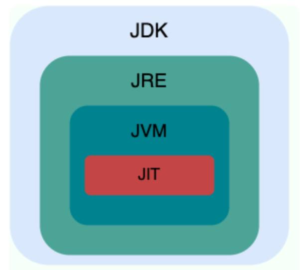

## 专业名词

基本类型（byte-8、short-16、int-32、long-64、char-16、float-32、double-32、boolean-1）

对象类型/包装类型（Byte、Short、Integer、Long、Character、Float、Double、Boolean）

方法=函数、方法参数

类、对象、成员变量/对象属性、成员方法/类方法

## 常见名词缩写

[Redis](https://redis.io/) （**Re**mote **Di**ctionary **S**erver）

**JVM：**Java 虚拟机，运行 Java 字节码的虚拟机，平台兼容，给定相同的字节码都会给出相同的输出

**JRE：**Java 运行时环境，运行已编译 Java 程序的内容集合，主要包含 JVM 和 Java 基础类库

**JDK：**Java 开发工具，开发、调试、编译、运行 Java 文件的工具程序集合，包含 JRE、Java 源码编译器 javac 以及其他工具，比如 javadoc（文档注释工具）、jdb（调试器）、jconsole（Java 可视化监控工具）等

**POP**：（Procedural-Oriented Programming，面向过程编程）

**OOP**：（Object-Oriented Programming，面向对象编程）

**AOP**：（Aspect Oriented Programming，面向切面编程），一种编程范式，旨在将横切关注点（如日志记录、事务管理、安全控制等）与业务逻辑分离，以提高软件的可维护性、可扩展性和可重用性。

## JIT

Just-In-Time（即时编译），它是一种提高程序运行效率的技术。

JIT 是一种在运行时将字节码（Bytecode）即时编译为本地机器码（Native Machine Code）的技术。在 Java 中，Java 源文件（`.java`）经过编译器编译后会生成字节码文件（`.class`），这些字节码可以在任何实现了 Java 虚拟机（JVM）的平台上运行。**JIT 编译器则在程序运行期间，动态地将部分字节码转换为本地机器码，以提高程序的执行速度。**

JIT 编译器的工作过程（原理）主要分为以下几个步骤：

1. **解释执行**：Java 程序启动时，JVM 首先以解释执行的方式运行字节码。解释器逐行读取字节码并将其翻译成机器码执行，这种方式启动速度快，但执行效率相对较低。
2. **热点代码检测**：JVM 会对程序的运行情况进行监控，记录每个方法的调用次数和循环执行次数等信息。**当某个方法或代码块被频繁调用时，就会被认定为“热点代码”（Hot Spot）。**
3. **即时编译**：一旦检测到热点代码，JIT 编译器就会将该代码块的字节码编译成本地机器码。编译后的机器码会被缓存起来，下次再执行相同代码时，就可以直接运行本地机器码，而无需再次进行解释执行，从而提高执行效率。
4. **优化**：JIT 编译器在编译过程中还会对代码进行一系列优化，如方法内联、常量折叠、死代码消除等，进一步提高代码的执行性能。

在 HotSpot JVM 中，常见的 JIT 编译器有两种：

- **C1 编译器**：也称为客户端编译器（Client Compiler），它的编译速度快，启动时间短，但生成的机器码优化程度相对较低，适用于对启动时间要求较高的客户端应用程序。
- **C2 编译器**：也称为服务器端编译器（Server Compiler），它的编译速度相对较慢，但生成的机器码优化程度高，执行效率高，适用于对性能要求较高的服务器端应用程序。
- **Graal 编译器**：是一个新的 JIT 编译器，它支持动态编译和静态编译，具有更好的性能和可扩展性，未来有望成为 JVM 的默认编译器。

通过使用 JIT 编译技术，Java 程序可以在保持跨平台特性的同时，获得接近本地编译语言的执行性能。 

## AOT

（Ahead of Time Compilation）：JDK9 引入的新的编译模式

- 在程序执行前就将其编译成机器码，属于静态编译，提高了 Java 程序的启动速度，避免预热时间长
- AOT 编译后的程序不易被反编译和修改，提高了 Java 程序的安全性，减少了内存占用，特别适合云原生场景

## QPS

QPS（Query Per Second）：服务器每秒可以执行的查询次数

QPS（Queries Per Second）是每秒查询率，是对一个特定的查询服务器在规定时间内所处理流量多少的衡量标准。在数据库领域，它用于衡量数据库服务器在一秒钟内能够响应的查询次数。例如，一个数据库系统的 QPS 为 1000，表示它每秒可以处理 1000 个查询请求。

## CAS

CAS 是 Compare - And - Swap 的缩写，即**比较并交换**。它是一种乐观锁的实现方式，用于在多线程环境下实现对共享变量的原子操作。在 Java 中，java.util.concurrent.atomic包下的原子类（如AtomicInteger、AtomicLong等）就是通过 CAS 机制来实现原子操作的。

## JPA

JPA（Java Persistence API）是 Java EE（Enterprise Edition） 5.0 标准之一，是一个用于对象持久化的 Java API。它为 Java 开发人员提供了一种以面向对象的方式来管理关系型数据库中数据的机制。简单来说，就是可以通过 JPA 方便地将 Java 对象存储到数据库中，以及从数据库中读取数据并转换为 Java 对象。

## ORM

ORM（Object - Relational Mapping），即对象 - 关系映射，是一种编程技术，用于在面向对象编程（Object - Oriented Programming，简称 OOP）中的对象和关系型数据库（Relational Database）中的表之间建立一种映射关系。

JPA 是一种 ORM（Object - Relational Mapping）规范。ORM 是一种编程技术，用于在面向对象的编程语言和关系型数据库之间建立桥梁。JPA 定义了一系列的接口和规则，而具体的实现则由不同的 JPA 提供商来完成，如 Hibernate、EclipseLink 等。这些提供商实现了 JPA 规范，开发人员可以根据自己的需求选择合适的实现框架。

