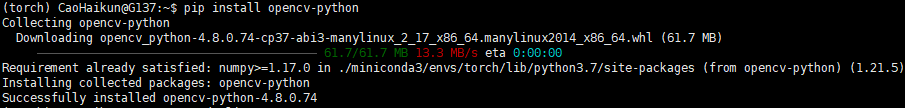
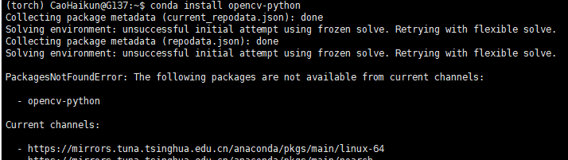

# 在申请的测试服务器上安装miniconda和PyTorch

使用SSH客户端（OpenSSH、Shell7等）连接上测试服务器后，在SSH终端命令行执行安装

## 安装miniconda
1. 下载miniconda软件
```shell
wget https://mirrors.tuna.tsinghua.edu.cn/anaconda/miniconda/Miniconda3-latest-Linux-x86_64.sh
```
2. 安装miniconda软件，输入下面命令按照提示进行安装：

   ```bash Miniconda3-latest-Linux-x86_64.sh```

   - 点击**control+C** 跳过协议阅读
   - 第一次输入yes启动安装
   - 输入一个名字，用来创建存储安装包的文件夹
   - 第二次输入yes完成安装
   - 重启终端使用miniconda
3. 修改conda配置信息：

 在命令行输入```conda config```生成配置文件，然后修改配置文件的信息（方便以后安装python包），输入命令```vim ~/.condarc```进入配置文件中
  改成：
```
auto_activate_base: false
channels:
  - defaults
show_channel_urls: true
default_channels:
  - https://mirrors.tuna.tsinghua.edu.cn/anaconda/pkgs/main
  - https://mirrors.tuna.tsinghua.edu.cn/anaconda/pkgs/r
  - https://mirrors.tuna.tsinghua.edu.cn/anaconda/pkgs/msys2
custom_channels:
  conda-forge: https://mirrors.tuna.tsinghua.edu.cn/anaconda/cloud
  msys2: https://mirrors.tuna.tsinghua.edu.cn/anaconda/cloud
  bioconda: https://mirrors.tuna.tsinghua.edu.cn/anaconda/cloud
  menpo: https://mirrors.tuna.tsinghua.edu.cn/anaconda/cloud
  pytorch: https://mirrors.tuna.tsinghua.edu.cn/anaconda/cloud
  pytorch-lts: https://mirrors.tuna.tsinghua.edu.cn/anaconda/cloud
  simpleitk: https://mirrors.tuna.tsinghua.edu.cn/anaconda/cloud
ssl_verify: false
```
具体细节参考[清华镜像](https://mirrors.tuna.tsinghua.edu.cn/help/anaconda/)

4. 一些conda常用命令

```she
conda config --show  # 查看所有的配置选项
conda config --show channels    #显示配置文件中的下载源

conda config --remove channels 源url    # 删除镜像源
```

5. 用命令```nvidia-smi```查看显卡型号


## 安装pytorch-gpu
1. 创建虚拟环境（创建Python3.7的环境，如果创建高版本的Python，那么下面安装PyTorch的命令会因为依赖包的版本不适配报错）
```shell
conda create -n torch python=3.7
```
2. 激活虚拟环境
```shell
conda activate torch
```
3. 在torch环境安装pytorch

> 因为测试服务器中已经安装好CUDA（可用命令nvcc -V查看安装的CUDA版本），因此直接安装PyTorch就可以

```shell
conda install pytorch-gpu  matplotlib jupyter notebook -y #这样子会安装比较老的版本
```
如果要安装比较新的版本建议去官网看：[pytorch-previous-versions](https://pytorch.org/get-started/previous-versions/)
```
# 如果你在137～139服务器可以使用以下命令安装 CUDA 11.3，安装会比较慢，给它点耐心
conda install pytorch==1.10.0 torchvision==0.11.0 torchaudio==0.10.0 cudatoolkit=11.3 -c pytorch -c conda-forge
```

按照上述流程安装应该就可以了，有需要的可查看更详细的[安装教程链接](http://t.csdn.cn/PbwKY)

4. 安装好了打开python看看：

```shell
python
```
```python
# 测试pytorch能否成功使用GPU
import torch
torch.cuda.is_available()

# 显示True则代表安装成功
```
5. 环境相关操作

```shell
删除环境(如果以后需要）:
conda remove -n torch --all
 
退出环境(如果以后需要）
conda deactivate

查看conda环境列表：
conda env list
```


## 安装OpenCV

切换到torch虚拟环境，输入命令```pip install opencv-python```进行安装，不需要额外的命令参数：



注意不要使用conda install opencv-python，会报错提示当前的channels无法安装opencv：



## 设置免密登入
1. 在客户端（自己的电脑，该段操作都是在客户端进行）上生成密钥，如果有就跳过
```shell
cd ~/.ssh
ssh-keygen -t rsa
```
2. 读取并复制公钥匙
```shell
cat id_rsa.pub
```
3.  客户端使用指令向服务端进行密钥发送
```shell
ssh-copy-id [你的用户名]@[xx.xx.xx.xx服务器主机名]
```