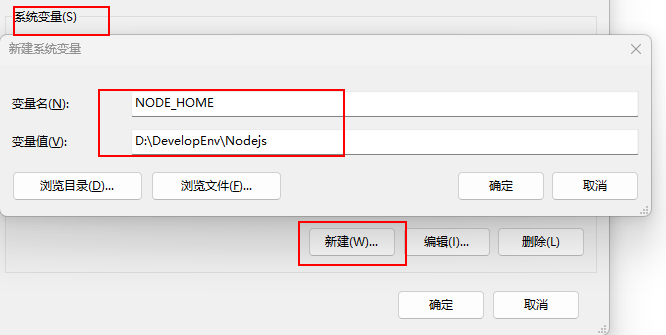

总结编程中常用到的命令

<!-- more -->

## pip常用命令

### 1. 安装pip

1. 安装pip

> 方式一：官网下载用Linux命令解压安装

- 进入[官网](https://pypi.python.org/pypi/pip)，下载 .tar.gz压缩包
- Linux安装pip

```linux
tar -xzvf pip-1.5.4.tar.gz      解压
cd pip-1.5.4                    进入解压文件
python setup.py install         安装
```

> 方式二：下载并安装Python，会自动安装pip

2. 升级pip的命令

```python
pip install --upgrade pip
```

### 2. 使用pip

1. 使用pip安装包的命令

```python
pip install 包名
```

2. pip查看是否已安装

```python
pip show --files 安装包名
```

显示：

```python
 Name:SomePackage    # 包名
 Version:1.0         # 版本号
 Location:/my/env/lib/pythonx.x/site-packages   # 安装位置
 Files:              # 包含文件等等
  ../somepackage/__init__.py
  [...]
```

3. pip检查哪些包需要更新

```python
pip list --outdated
```

4.  pip升级包

```python
pip install --upgrade 包名
```

5. pip卸载包

```python
pip uninstall 包名
```

### 3. pip参数解释

```python
# pip --help
 
Usage:  
 pip<command>[options]
 
Commands:
 install                    安装包.
 uninstall                  卸载包.
 freeze                     按着一定格式输出已安装包列表
 list                       列出已安装包.
 show                       显示包详细信息.
 search                     搜索包，类似yum里的search.
 wheel                      Buildwheelsfromyourrequirements.
 zip                        不推荐.Zipindividualpackages.
 unzip                      不推荐.Unzipindividualpackages.
 bundle                     不推荐.Createpybundles.
 help                       当前帮助.
 
GeneralOptions:
 -h,--help                 显示帮助.
 -v,--verbose              更多的输出，最多可以使用3次
 -V,--version              现实版本信息然后退出.
 -q,--quiet                最少的输出.
 --log-file<path>          覆盖的方式记录verbose错误日志，默认文件：/root/.pip/pip.log
 --log<path>               不覆盖记录verbose输出的日志.
 --proxy<proxy>            Specifyaproxyintheform[user:passwd@]proxy.server:port.
 --timeout<sec>            连接超时时间(默认15秒).
 --exists-action<action>   Defaultactionwhenapathalreadyexists:(s)witch,(i)gnore,(w)ipe,(b)ackup.
 --cert<path>              证书.
```


## Anaconda常用命令

### 1. 生成配置文件并查看相关配置

```python 
conda config  #生成配置文件.condarc
键盘键入Windows+R，输入%HOMEPATH%，可找到配置文件所在目录
conda config --show  # 查看所有的配置选项
conda config --show channels    #显示配置文件中的下载源
```

### 2. 添加镜像源

```python
# 添加清华镜像
conda config --add channels https://mirrors.tuna.tsinghua.edu.cn/anaconda/pkgs/free/
conda config --add channels https://mirrors.tuna.tsinghua.edu.cn/anaconda/pkgs/main/
# 添加pytorch镜像
conda config --add channels https://mirrors.tuna.tsinghua.edu.cn/anaconda/cloud/pytorch/
# for legacy win-64
conda config --add channels https://mirrors.tuna.tsinghua.edu.cn/anaconda/cloud/peterjc123/
# 从 channel 中安装包时显示 channel 的 url, 方便查看包的安装来源
conda config --set show_channel_urls yes
```

### 3. 删除镜像源

```python
conda config --remove channels 源url
```

### 4. 虚拟环境相关操作

```python
# 查看虚拟环境列表
conda env list
# 创建新的虚拟环境
conda create --name envname python=3.10

# 注意1：
修改创建虚拟环境的默认位置（默认是在C盘的某个目录下，可通过conda config --show envs_dirs查看，第一个为默认位置）
首先：
	在配置文件.condarc最后加入：
    envs_dirs:
        - 希望改为的绝对路径（我的是Anaconda的安装目录下的envs目录：D:\FileApp\DevelopApp\Anaconda\envs）
    或者直接在命令行敲命令：conda config --add envs_dirs 希望改为的绝对路径
然后：
	因为在安装Anaconda时有可能是为此电脑多有用户可用，因此Anaconda的安装目录的权限默认设置为只读不可修改，而创建虚拟环境	则是在该Anaconda安装目录下的envs目录下创建，若权限为只读的话则无法创建成功，而是创建到默认的C盘目录下，解决办法是修改Anaconda安装目录下的envs文件夹的权限，取消只读并是user获取所有修改权限，操作：点击envs文件夹->右击属性->常规中取消勾选“只读”->安全->User中将权限全都勾上。
# 注意2：
若在创建虚拟环境时指定Python版本，务必要将新创建的虚拟环境中Python配置文件中的Scripts目录添加到环境变量PATH中

# 激活并进入新环境
conda activate envname
# 关闭虚拟环境
conda deactivate
# 删除虚拟环境
conda remove -n envname --all
```

### 5. 安装pytorch

1. 安装cpu版本的PyTorch

```python
在配置好pytorch的清华源之后可以在conda prompt中切换为指定的虚拟环境（该环境已配置好Python包），在该虚拟环境下执行以下命令：
conda install pytorch torchvision torchaudio cpuonly

安装pytorch2.0（CPU版本）的命令：
pip3 install numpy --pre torch torchvision torchaudio --force-reinstall --index-url https://download.pytorch.org/whl/nightly/cpu
```

2. 安装GPU环境的PyTorch2.0以上版本：

> 前提是电脑已经安装了对应cuda驱动，下面命令会自动根据你的cuda驱动安装对应的Python依赖包

```python
# 先设置清华源（不是conda config，而是pip config）
pip config set global.index-url https://pypi.tuna.tsinghua.edu.cn/simple
# 再安装指定版本的PyTorch
pip3 install torch==2.0.1 torchvision torchaudio
```

### 6. 在jupyter中利用虚拟环境创建python文件

创建好虚拟环境，如何在jupyter中利用该虚拟环境创建python文件：

```python 
# 首先在命令行激活该虚拟环境，并下载ipykernel包
pip install ipykernel
# 接着将虚拟环境写入Jupyter的kernel中
python -m ipykernel install --name {你的虚拟环境名字，如qq} --display-name {你想显示的名称}
刷新即可大功告成，可以在Jupyter中利用该环境美美编程了
```


## Git操作命令

### 1. 安装Git后的初始操作

```python
给电脑中的Git绑定名字和邮箱：
$ git config --global user.name "Your Name"
$ git config --global user.email "email@example.com"

可通过以下命令查看是否安装成功：
git config user.name
git config user.email

查看Git全局配置信息的命令：
git config --global -l
```

安装完Git之后，你需要进行一些配置以连接到远程仓库。主要的配置包括：

1. **设置用户名和邮箱：** 在Git中，每次提交代码都会记录作者信息，因此需要配置用户名和邮箱。可以通过以下命令设置：

   ```
   git config --global user.name "Your Name"
   git config --global user.email "your_email@example.com"
   ```

2. **生成SSH密钥（可选）：** 如果你使用SSH协议连接到远程仓库（比如GitHub、GitLab等），建议生成SSH密钥。这样可以免去每次输入密码的麻烦。生成SSH密钥的命令是：

   ```
   ssh-keygen -t rsa -b 4096 -C "your_email@example.com"
   ```

   这个命令会在默认的SSH密钥目录下生成一对公钥和私钥。生成过程中可以选择设置密码保护私钥，也可以留空直接回车。

3. **将SSH公钥添加到远程仓库：** 如果你生成了SSH密钥，需要将生成的公钥添加到你的远程仓库账户中。这样远程仓库才能识别你的身份并允许你访问。具体步骤请参考你使用的远程仓库服务商的文档。

4. **配置远程仓库地址：** 在本地仓库中，你需要配置远程仓库的地址。可以使用以下命令添加远程仓库：

   ```
   git remote add origin <remote_repository_URL>
   ```

   其中，`<remote_repository_URL>` 是你远程仓库的URL地址。

5. **验证配置是否成功：** 可以使用以下命令验证是否成功连接到远程仓库：

   ```
   git remote -v
   ```

完成以上配置后，你就可以通过Git和远程仓库进行交互了，比如拉取代码、推送代码等操作。

### 2. Git相关操作

git操作命令行参考：https://backlog.com/git-tutorial/cn/reference/

#### 1）最基本的三步操作

```python
# 1. 仓库初始化
将目前目录初始化为Git能够管理的仓库，在当前目录下右键选择Git Bash Here，在跳出来的命令框输入：
git init
即可将当前目录初始化为仓库

# 2. 往仓库添加文件必要的两个步骤，按顺序输入命令
1）首先将文件添加到仓库的暂存区，该命令可以执行多次，切每次命令可添加多个文件
命令：
git add 文件名1 文件名2
2）把暂存区的所有内容提交到当前的分支，并告诉仓库你做了什么（通过附加信息说明）
命令：
git commit -m "解释你提交文件的信息"
参数-m是-- message的缩写

# 3. 向远程仓库提交项目
如果是初始创建的本地仓库，需要先建立本地仓库和远程仓库的连接（远程仓库已经创建的前提下），连接远程仓库的命令：
git remote add <repositoryname一般写origin> <创建的远程仓库链接>
建立连接之后将本地仓库push到远程仓库的命令：
git push <repositoryname> <branchname>
如果远端仓库是初次建立的话，远端仓库是没有分支的，因此初次push的时候需要加入--set-upstream参数来为远程仓库建立同名分支，即为以下命令：
git push --set-upstream <repositoryname> <branchname> 	
```

#### 2）查看status、diff、log、checkout等

1. status

```
可通过下面命令查看仓库的当前状态，方便进行决策：
git status
```

2. diff

```
假设通过上面的状态命令得知readme.md文件修改了，则可以通过下面命令查看具体修改情况：
git diff readme.md
```

3. log

> 在Git中，用HEAD指向当前版本(查看日志信息可发现)，上一个版本就是`HEAD^`，上上一个版本就是`HEAD^^`，当然往上100个版本写100个`^`比较容易数不过来，所以写成`HEAD~100`。

```
查看以前的提交日志：
git log
显示标签资料的历史记录（比较详细）：
git log --decorate
显示精简的日志信息（比较简略，只有commit id和对应注解）：
git log --pretty=oneline
```

4. checkout

```
加入你修改了readme.md文件的内容，保存退出后想撤销刚才的修改，可以通过下面命令实现：
git checkout -- <filename>
注意：一定要加上--，并且--和需要撤销修改的文件名之间有空格，别忘了，如果不加--，那就是切换分支的操作了，在第5)条会说明；
checkout操作就是一键还原操作，即使你刚才把readme.md文件删除，然后通过git checkout readme.md命令，也可以把误删的文件恢复
```

#### 3) 与远端仓库的交互

1. pull：执行pull，远程仓库的内容就会合并到本地。但是，有时只是想确认本地数据库的内容而不想合并。这种情况下，就需要使用fetch。

2. fetch：执行fetch可以取得远程数据库的最新历史记录。取得的提交会导入到没有名字的分支，这个分支可以从名为FETCH_HEAD的退出。例如，在本地数据库和远程数据库的origin，如果在从B进行提交的状态下执行fetch，就会形成如下图所示的历史记录。

3. push：执行push，会将本地仓库的修改推送到远程仓库，并与远程仓库进行合并
4. 相关命令

```
初始创建的本地仓库需要先建立本地仓库和远程仓库的连接（远程仓库已经创建的前提下），连接远程仓库的命令：
git remote add <repositoryname一般写origin> <创建的远程仓库链接>

查看本地仓库已绑定的远端仓库列表用下面命令（参数-v可选，用来显示远端仓库的详细信息）：
git remote -v

删除本地仓库已绑定的某个远端仓库：
git remote rm <repositoryname>

将本地仓库push到远程仓库的命令(已建立连接的情况下)：
git push <repositoryname> <branchname>

拉取远端仓库与本地仓库合并的命令(已建立连接的情况下)：
git pull 
```

#### 4） 标签操作

1. 什么是标签？

标签是为了更方便地参考**提交（commit）**而给它标上易懂的名称，也即对每次的提交(commit)设置一种易懂的名称。tag就是一个让人容易记住的有意义的名字，它跟某个commit绑在一起。

2. 标签相关命令

创建标签：

> 默认创建的标签是和最新commit绑定在一块

```
创建标签（轻标签）：
git tag <tagname>
创建注解标签：
git tag -a <tagname> -m "注解内容"
如果想要对以往的某次commit打上标签，则需要找到那次commit对应的commit id，用下面命令打标签：
git tag <tagname> <commit id>
```

删除标签

```
删除标签：
git tag -d <tagname>
```

查看标签列表：

```
查看标签列表的命令(注意：标签不是按时间顺序列出，而是按字母排序的)：
git tag
查看标签列表并同时显示注解信息（添加参数-n）：
git tag -n
根据标签名查看该标签的详细信息：
git show <tagname>
```

#### 5）操作分支的命令

```
创建分支：
git branch <branchname>
删除分支（在branch后面指定-d参数就是删除分支）：
git branch -d <branchname>
查看分支有哪些(带星号的表示当前所在branch)：
git branch
```

```
切换分支（假设切换到分支issue1）：
git checkout issue1
创建并切换分支(通过添加参数-b来执行)：
git checkout -b <branch>
```

```
合并分支的操作（一般是将其他分支合并到主分支master中），例如在分支issue1中进行了修改，现在需要将issue1分支合并到主分支master中，合并操作如下：
首先要切换到master分支上：
git checkout master
然后再把issue1分支导入到master分支上:
git merge issue1
```

#### 6) 版本回退reset

假设当前版本（也就是HEAD指向的版本）为version1，上一个版本为version2（HEAD^），上上版本为version3（HEAD^^）,则:

```
进行版本回退的命令：
git reset --hard HEAD^
这样你的版本就回退到version2了

如果你还想再回到version1，那需要再找到version1那次提交对应的commit id（随便设为290ab4），则还是用reset命令进行回退：
git reset --hard 290ab4

如果你找不到version1对应commit的那次id怎么办，不慌，可以通过以下命令进行查看：
git reflog
这个命令会记录以往的每次命令并显示出来
```

### 查看Git配置范围

要确定你当前是为哪个 Git 仓库进行配置，可以通过查看 Git 的配置文件来获取信息。Git 使用三个不同的级别来存储配置信息：全局（global）、仓库范围内（local）、系统范围内（system）。你可以根据配置的范围来确定当前配置是针对哪个 Git 仓库的。

#### 使用命令查看当前配置的范围

你也可以使用 `git config --list --show-origin` 命令来查看当前配置的范围和来源。该命令会列出所有的 Git 配置项及其来源（是全局、本地还是系统级别），这样你就可以确定当前配置是属于哪个级别的。

#### 使用命令查看当前所在的 Git 仓库路径

你可以使用 `git rev-parse --show-toplevel` 命令来查看当前所在的 Git 仓库的根目录路径。通过这个路径，你可以知道你正在为哪个 Git 仓库进行配置。

使用这些方法中的任何一个，你都可以确定当前为哪个 Git 仓库进行配置。


## Nodejs安装操作

### 1. 安装注意事项

1. 将安装路径改到D盘的开发文件夹内
2. 除了修改安装路径，其他一路点击next，保持默认设置，直至安装完成
3. 安装完成后查看安装是否成功？

- 打开cmd，输入`node -v`可查看Nodejs的版本
- 包管理器npm随着Nodejs一起安装至电脑中，通过在cmd输入命令`npm -v`查看npm版本，如果均显示出版本号则代表安装成功

### 2. 安装完Nodejs后需要进行的操作

1. 创建文件夹

   在Nodejs的安装目录下`D:\DevelopEnv\Nodejs`创建两个文件夹node_cache和node_global

2. 修改环境变量

  - 针对用户变量：将Path中刚才安装Nodejs时默认生成的路径`C:\Users\Hishallyi\AppData\Roaming\npm` 修改为刚才创建的【node_global】文件夹的路径`D:\DevelopEnv\Nodejs\node_global`

  - 针对系统变量：在系统变量中新建变量`NODE_HOME`，变量值为安装Nodejs的根目录`D:\DevelopEnv\Nodejs`

    

    然后在系统变量的Path中添加以下三个路径：

    ```
    %NODE_HOME%
    %NODE_HOME%\node_global
    %NODE_HOME%\node_cache
    ```

    以上即完成了环境变量的设置

3. 修改npm相关配置

  > 键盘WIN+R打开输入框，输入`cmd`打开命令提示符

  **修改npm安装包时cache和prefix的默认目录，改为刚创建的两个文件下**
  分别在cmd命令行中输入下面两条命令并回车确认，若没提示则修改成功（可通过`npm config ls`查看配置结果）

  ```
npm config set prefix "D:\DevelopEnv\Nodejs\node_global"
npm config set cache "D:\DevelopEnv\Nodejs\node_cache"
  ```

  查看是否设置成功可以用下面两个命令：

  ```
npm config get prefix
npm config get cache     # 如果对应目录是上面设置的目录那说明就是对的
  ```

  **修改npm安装源，改为国内镜像源**

  在cmd中输入下面命令：

  ```
npm config set registry https://registry.npmmirror.com
  ```

  > 注意：以前的淘宝镜像网站已经不能用了，也就是说不能把源设置为https://registry.npm.taobao.org/，不然安装的时候会报错

4. 在node_global目录下创建文件夹node_modules（如果没有的话），用来存放npm安装的包

### 3. Nodejs常用命令

```python
npm root -g   # 查看利用npm安装包时的默认安装路径
npm config ls # 查看npm配置
npm config ls -l # 查看npm所有配置

# 设置淘宝镜像
npm config set registry https://registry.npmmirror.com
# 查看是否安装成功
npm config get registry
# 安装中国版的包管理器cnpm（如果出现4048错误，可参考https://blog.csdn.net/wzxzRoad/article/details/122766142）
npm install -g cnpm --registry=https://registry.npmmirror.com

# 查看cnpm是否安装成功
cnpm -v

# 查看最根目录安装了哪些包
npm list --depth=0 -global

# 查看当前项目安装了哪些包
npm list

npm -v：# 查看npm安装的版本。
npm init：# 会引导你建立一个package.json文件，包括名称、版本、作者等信息。
npm list：# 查看当前目录下已安装的node包。
npm ls：# 查看当前目录下已安装的node包。
npm install moduleNames：# 安装Node模块到本地目录node_modules下。
npm install < name > -g：# 将包安装到全局环境中。
npm install < name > --save：# 安装的同时，将信息写入package.json中，项目路径中若是有package.json文件时，直接使用npm install方法就能够根据dependencies配置安装全部的依赖包，这样代码提交到git时，就不用提交node_modules这个文件夹了。
npm install < name> --save-dev：# 安装的同时，将信息写入package.json中项目路径中若是有package.json文件时，直接使用npm install方法就能够根据devDependencies配置安装全部的依赖包，这样代码提交到git时，就不用提交node_modules这个文件夹了。
npm uninstall moudleName：# 卸载node模块。
```

### 4. npm安装包的方式：

1. 全局安装在任何文件夹都可运行，原理是写进环境变量，每次在命令行中敲入命令时，根据环境变量的设置寻找对应的可执行程序运行

```python
npm install -g <package_name>
```

2. 局部安装就是在当前项目中建立包，在当前项目中起作用

```python 
npm install <package_name>
```

### 5. npm安装常用包的命令

1. 安装vue

```
npm install -g vue
```

2. 安装vue脚手架

```shell
npm install -g @vue/cli

// 安装指定版本的vue-cli(这个就不用全局安装了)
npm install vue-cli@需要安装的版本号
```

查看所有的vue-cli版本号的命令：`npm  view vue-cli versions --json`


## Vue相关命令

### 1. vue版本冲突的解决办法

当本地安装的npm版本较高，造成无法解析Vue项目中的依赖树，进而导致项目依赖下载失败时，可尝试使用如下命令解决此问题：

```
npm install --legacy-peer-deps
```

### 2. 脚手架快速创建项目

```
vue create 项目名称
```

注意：项目名称不能有大写字母


## 生成SSH密钥进行免密登录

要设置SSH免密码登录，可以按照以下步骤进行操作：

> 注意：以下命令是在本地电脑的PowerShell中运行的，并不是在命令提示符cmd中运行的

1. 生成公私钥对：首先，在本地计算机上生成公私钥对。可以使用以下命令生成，默认情况下会生成RSA密钥对。

   ```shell
   ssh-keygen -t rsa
   ```

   执行命令后，会提示你选择密钥保存的路径和输入密码（留空代表无密码）。**生成的公私钥文件分别是`id_rsa.pub`（公钥）和`id_rsa`（私钥）**。

2. 将公钥复制到目标服务器：将本地生成的公钥复制到目标服务器上的`~/.ssh/authorized_keys`文件中。

   ```shell
   ssh-copy-id user@server-ip
   ```

   或者手动方式，将本地的公钥内容复制到目标服务器的`~/.ssh/authorized_keys`文件。

   如果在Win10或Win11上配置时出现下面错误：

   > ssh-copy-id : 无法将“ssh-copy-id”项识别为 cmdlet、函数、脚本文件或可运行程序的名称。

   解决方案是在PowerShell中先执行以下内容：

   ```shell
    function ssh-copy-id([string]$userAtMachine, $args){   
       $publicKey = "$ENV:USERPROFILE" + "/.ssh/id_rsa.pub"
       if (!(Test-Path "$publicKey")){
           Write-Error "ERROR: failed to open ID file '$publicKey': No such file"            
       }
       else {
           & cat "$publicKey" | ssh $args $userAtMachine "umask 077; test -d .ssh || mkdir .ssh ; cat >> .ssh/authorized_keys || exit 1"      
       }
   }
   ```

   

3. 验证免密码登录：尝试使用SSH登录目标服务器，应该不再需要输入密码。

   ```shell
   ssh user@server-ip
   ```

   如果一切配置正确，你应该能够直接登录到目标服务器，而无需输入密码。

需要注意的是，以上步骤假设你已经在服务器上设置了SSH服务，并且你拥有对目标服务器的登录凭证。

另外，为了确保SSH连接的安全性，建议采取以下措施：

- 设置私钥文件的权限：为了保护私钥的机密性，将私钥的权限设置为只有当前用户可读写，可以执行以下命令：

  ```shell
  chmod 600 ~/.ssh/id_rsa
  ```

- 禁用密码登录：为了提高安全性，可以在目标服务器上禁用密码登录，只允许公钥登录。在SSH服务器配置文件（通常是`/etc/ssh/sshd_config`）中将`PasswordAuthentication`设置为`no`。然后重新加载SSH服务。

  ```shell
  sudo service sshd reload
  ```

这样，你就设置了SSH免密码登录，方便快捷地使用SSH连接目标服务器。
