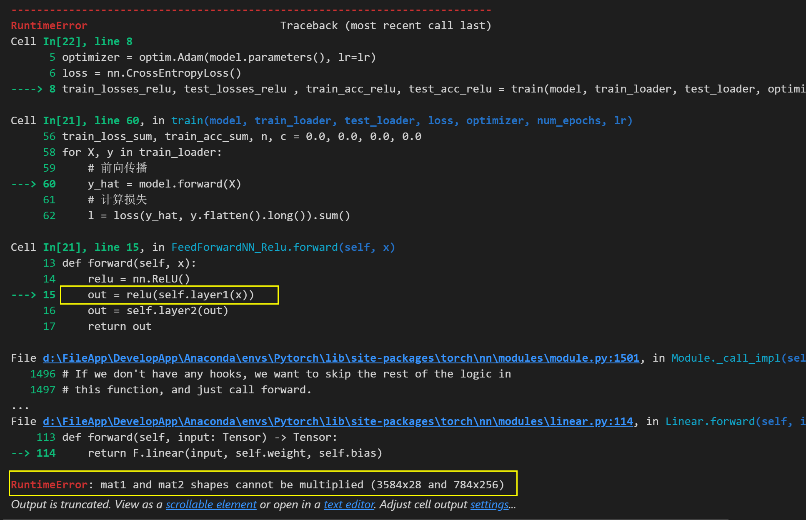
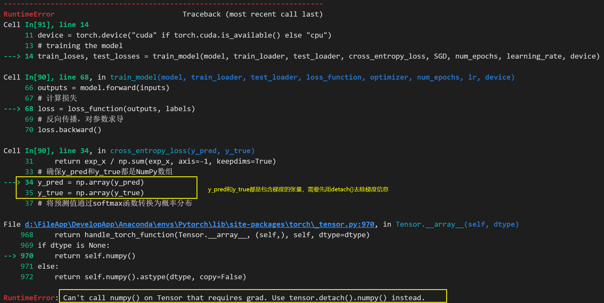

# Hishallyi的炼丹房

> 前言1：总结自己用PyTorch框架训练神经网络中遇到的报错和解决方案，改bug不易，好记性不如烂笔头，并记录一些不太成熟的炼丹心得
>
> 前言2：训练模型的过程是一件充满玄学的过程，炼丹的前提是要有一个能够接受各种离谱结论的心态，保持好心态，你会不断遇到越来越离谱的结论...
>
> 原则：能Ctrl + C, V绝不动手敲


## 1. Loss值异常

### 1.1 Loss全为0

总结的原因：

1. 用错损失函数了！回归任务别用交叉熵损失，交叉熵损失只能用于分类任务，回归任务可以用均方误差mse等
2. 自己生成的数据，生成出错；
3. 数据太简单，模型太简单，计算类型单一，采用的优化器太好（用的Adam而不是SGD），计算的损失为0；
4. 学习率太大，设置的epoches数量太大，往往前几个epochLoss值就下降为0，后面就全是0；

解决办法：**增加隐藏层数、减少训练的epochs、换参数优化算法**

### 1.2 交叉熵作损失，Loss全为nan

【ChatGPT】版回答：

如果训练模型跑出来的`train_loss`和`test_loss`全为NaN，通常有以下几种可能的原因：

1. **学习率过大或过小：** 学习率是控制梯度下降步长的重要超参数。如果学习率过大，可能导致梯度下降过程中错过最优解，损失函数可能不收敛而出现NaN。如果学习率过小，收敛速度会非常缓慢，可能需要更多的训练周期。建议尝试不同的学习率进行调整。
2. **权重初始化问题：** 权重的初始化可以影响模型的收敛性。如果权重初始化过大或过小，可能导致梯度消失或梯度爆炸的问题。尝试使用不同的权重初始化方法，如Xavier初始化或He初始化，可以改善这个问题。
3. **数据处理问题：** 数据处理不当可能导致梯度计算出现问题。例如，如果出现除以零的情况，会导致损失函数计算出现NaN。检查数据是否有异常或处理不当。
4. **模型架构问题：** 模型架构可能导致数值不稳定，尤其是对于深层神经网络。尝试简化模型架构或添加正则化来减轻过拟合。
5. **数值稳定性问题：** 在计算softmax和log时，数值可能不稳定导致NaN。可以尝试使用PyTorch内置的函数来计算softmax和log，这些函数已经优化过，并且在数值上更加稳定。

根据您提供的代码，有几个可能的问题。请检查以下几点：

1. 确保输入数据的类型正确：在训练模型时，将输入数据转换为`torch.float32`类型，以确保数据和模型权重的类型一致。
2. 检查是否有异常的数据：请确保数据没有缺失值或异常值，这可能导致计算中出现问题。
3. 检查是否有除以零的情况：在计算损失函数时，可能存在除以零的情况，导致损失函数计算出现NaN。
4. 检查学习率和权重初始化：尝试使用较小的学习率，并使用合适的权重初始化方法。
5. 使用PyTorch内置函数：尝试使用PyTorch内置的函数来计算softmax和log，例如`torch.nn.functional.softmax`和`torch.nn.functional.cross_entropy`。

【Hishallyi解决方案】：

炸炉，改了老半天，数据改了，损失函数改了，训练过程的函数也改了，损失值还是异常，无语...暂定


### 1.3 交叉熵作损失，Loss全为负数

【ChatGPT】版回答：

当使用交叉熵作为模型损失函数时，训练集损失值和测试集损失值均为负数可能是由于以下几个原因：

1. **学习率过大：** 学习率是控制梯度下降步长的重要超参数。如果学习率过大，模型在训练过程中可能跳过最优解，损失函数可能出现震荡或不稳定的情况，从而导致损失值为负数。建议尝试减小学习率，使模型能够更稳定地收敛。
2. **数据预处理问题：** 数据预处理的方式可能不当，例如数据的缩放范围不一致，导致模型权重的更新过大或过小。确保对输入数据进行适当的预处理，例如归一化或标准化，以避免这个问题。
3. **模型架构问题：** 模型架构可能导致数值不稳定。例如，在深层神经网络中，可能出现梯度消失或爆炸的情况。尝试使用更简单的模型架构或添加正则化来减轻过拟合。
4. **数值稳定性问题：** 在计算交叉熵损失时，可能存在数值不稳定的情况，导致损失值为负数。可以尝试使用PyTorch内置的函数来计算交叉熵损失，这些函数已经优化过，并且在数值上更加稳定。
5. **过拟合：** 模型过拟合可能导致训练集损失值过低，甚至为负数。过拟合是指模型在训练集上表现良好，但在测试集上表现较差。为了解决过拟合问题，可以尝试使用正则化技术，如L1或L2正则化，或者增加数据量。

在解决问题时，您可以尝试按照以下步骤进行调整：

1. 减小学习率：使用较小的学习率，例如0.001或更小的值。
2. 检查数据预处理：确保数据预处理方式正确，尽量使得数据范围在合理区间内。
3. 使用PyTorch内置函数：尝试使用PyTorch内置的交叉熵损失函数，如`torch.nn.CrossEntropyLoss`，以确保数值稳定性。
4. 简化模型架构：尝试使用更简单的模型架构，避免过拟合。
5. 增加数据量：如果可能，增加数据量以减轻过拟合问题。


## 2. 报错

### 2.1 矩阵的数据类型不一致

PyTorch中构建的全连接层的权重weight、偏置数据bias的默认类型为torch.float32，而一般利用numpy创建的输入数据X转化为tensor类型后的类型为tensor.float64，因为全连接层在计算时会因为数据类型不一致报错，需要用to()函数将指定tensor变量的类型进行转换：

```Python
tensor_floart32 = tensor_float64.to(torch.float32)
```


### 2.2 矩阵的形状不一致不能相乘



出现矩阵乘法维度不匹配的错误。这是因为在`FeedForwardNN_Relu`模型的前向传播方法中，网络的第一层和输入数据的维度不匹配。具体来说，第一层的权重矩阵大小是`(784, 256)`，而输入数据的大小是`(batch_size, 1, 28, 28)`，经过`torch.flatten()`后的大小是`(batch_size, 784)`。

为了解决这个问题，我们需要调整网络的第一层的输入大小，使其与输入数据的大小相匹配。解决方法是通过将第一层的输入大小改为784，将输入展平的方式有很多，这里介绍两种方式：

1. 在模型的前向传播函数中将输入的x进行展平：


2. 在训练函数中，前向传播计算时进行shape的转换：


### 2.3 张量转化为numpy报错

在将包含梯度信息的张量转化为numpy型数据进行计算时，不能直接使用tensor.numpy()或者np.array(tensor)进行转化，而是需要在转化前将张量携带的梯度信息从计算图中分离，以防止梯度传播。分离方法：

```Python
# 使用detach()来分离
tensor_numpy = tensor_grad.detech().numpy()
```



### 2.4 数据加载器初始化出错


这是因为在下载数据时，加载器的参数设置出错，ToTensor()函数少了两个括号。


解决办法：正确定义数据加载器：给ToTensor()函数加上括号就好了

### 2.5 文件名解码出错


  **Cell** **In[2], line 33**    

​		**defog_dir = 'Experiments_3\Datasets\RemoveFogDatasets\NoFogPictures'**                                                                          

**SyntaxError** :  (unicode error) 'unicodeescape' codec can't decode bytes in position 40-41: malformed \N character escape

解决：

这个错误是由于字符串中的反斜杠被视为转义字符导致的。你可以尝试使用原始字符串来避免这个错误。在字符串前面加上一个 "r"，例如：`defog_dir = r'Experiments_3\Datasets\RemoveFogDatasets\NoFogPictures'`。这样反斜杠就会被当作普通字符处理，而不会引发解码错误。

### 2.6 数据加载器工作进程异常报错


这个报错是由于 `DataLoader` 中的一个或多个数据加载器工作进程异常退出导致的。在使用多进程加载数据时，可能会出现一些问题，导致数据加载器工作进程异常退出，从而引发 `RuntimeError`。

常见的原因包括：

1. 数据加载错误：某些样本文件不存在或路径错误，导致数据加载时出现异常。
2. 数据处理错误：在 `DataLoader` 中的 `collate_fn` 函数中进行数据预处理时，出现错误导致异常退出。
3. 内存不足：在使用多进程加载数据时，内存不足可能导致工作进程异常退出。

为了解决这个问题，可以尝试以下几个方法：

1. 检查数据集和文件路径：确保数据集中的所有文件都存在，路径正确，并且能够正常加载。可以使用 `os.path.exists()` 来检查文件是否存在。
2. 检查数据处理函数：如果在 `DataLoader` 中使用了自定义的 `collate_fn` 函数或数据预处理函数，确保这些函数能够正确处理样本。
3. 减少 `num_workers`：如果你设置了较大的 `num_workers` 值（数据加载器的线程数），尝试将其减少，因为较多的工作进程可能导致资源竞争和内存问题。
4. 尝试使用单进程加载数据：在创建 `DataLoader` 时，设置 `num_workers=0` 可以使用单进程加载数据，这有时可以避免多进程加载数据时的问题。

注意：`DataLoader` 在多进程加载数据时，使用了 Python 的 `multiprocessing` 库，而该库在 Jupyter 环境中有一些限制。如果仍然遇到问题，你可以尝试在普通的 Python 脚本中运行代码，或者查看是否有与 `multiprocessing` 相关的特殊配置和限制。

### 2.7 前向传播函数返回的值数量与解包数量不匹配


LSTM返回值的格式为：

```python
output, (h, c) = lstm(x)
```

接受的返回值应该为(h, c)，代码中只有output和hidden两个值，无法接收返回值

修改代码：

```python
output, _ = lstm(x)
```

用output来接收模型输出，另一个下划线来表示不接收隐藏状态。

