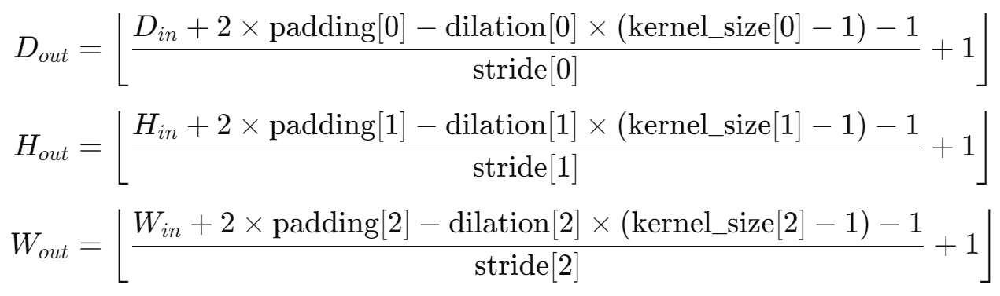

## LF数据增强

> 光场Light Field图像 数据增强操作

### 上采样upsampling


### 翻转flipping


### 旋转rotation


### 颜色转换color conversion


## visdom

`visdom`刚开始需要和`screen`联动使用，因为需要`screen`创建窗口，并保持`visdom`的持续运行。

> `screen` 是 Linux 系统中用于创建、管理和恢复会话的工具，可以使用相关命令来查看有哪些窗口。

### screen 常用命令

> 试了一下，在xshell里除了Ctrl + A + D 的快捷键其他快捷键都无法使用，还是老老实实用命令操作比较稳妥

**安装screen工具**

```bash
apt install screen // Ubuntu系统
yum install screen // CentOS系统
```

**创建窗口**

命令：`screen -S 窗口名称`

**查看有哪些窗口**

命令：`screen -ls`

**进入窗口 / 恢复会话**

命令：`screen -r 窗口名称`

也可以通过 `Ctrl + a` 然后按 `0` 到 `9` 之间的数字来切换到对应编号的窗口，或者使用 `Ctrl + a` 然后按 `n`（下一个窗口）、`p`（上一个窗口）来切换。

**暂时退出窗口 / 分离会话**

- 命令：`screen -d 窗口名称`
- 快捷键：`Ctrl + A + D`

**永久删除窗口**

方式一：

- 进入想要删除的窗口，按下 `Ctrl + a` 然后按 `k`。系统会提示是否真的要杀死这个窗口，输入 `y` 确认即可。

方式二：

- 命令：`screen -S [窗口名或编号] -X quit`

**重命名当前窗口**

- 按下 `Ctrl + a` 然后按 `A`，之后输入新的窗口名称。

方式二：

命令删除：`screen -S 窗口名称 -X quit`

**保存窗口内容**

可以使用 `screen` 的日志记录功能保存 `screen` 窗口的内容，步骤如下：

- 进入想要保存内容的窗口。

- 按下 `Ctrl + a` 然后按 `H`。这会开始记录该窗口的所有输出到一个日志文件中，日志文件默认命名为 `screenlog.n`，其中 `n` 是窗口编号。

- 当想停止记录时，再次按下 `Ctrl + a` 然后按 `H`。此时日志文件就保存了窗口的内容。

### visdom 使用

1. 在创建的窗口中启动visdom服务器：

```bash
python -m visdom.server -port [自己指定的端口，默认是8097]
```

2. 如果使用的是远程服务器，并且希望从浏览器访问 Visdom 服务，确保防火墙允许访问您设置的端口（默认为 8097）。可以根据使用的防火墙工具执行以下操作。

- 对于 `ufw` 防火墙：

```
sudo ufw allow 8097
```

- 对于 `firewalld` 防火墙：

```
sudo firewall-cmd --zone=public --add-port=8097/tcp --permanent
sudo firewall-cmd --reload
```

3. 访问visdom

在启动了 Visdom 服务之后，就可以在浏览器中访问它。假设设置的端口是默认的 8097，可以在浏览器中输入以下地址来访问 Visdom：

```python
http://<server_ip>:8097
```

4. 代码中如何使用visdom:

```python
import visdom

win = "window name"
vis = visdom.Visdom(env=str(win), server="ip address", port=9878)

def plot_loss(vis, epoch, train_loss, test_psnr):
    vis.line(
        X=np.array([[epoch]]),
        Y=np.array([[train_loss]]),
        win="Loss",
        update="append",
        opts=dict(
            title="LOSS",
            xlabel="Epoch",
            ylabel="Loss",
            legend=["total loss"],
        ),
    )

    if epoch % 10 == 0:
        vis.line(
            X=np.array([[epoch]]),
            Y=np.array([[test_psnr]]),
            win="PSNR",
            update="append",
            opts=dict(
                title="PSNR",
                xlabel="Epoch",
                ylabel="PSNR",
                legend=["test PSNR"],
            ),
        )
```


## SSIM手动实现

直接调包`skimage.metrics.structural_similarity`经常会因为版本numpy版本问题报错，即使按照要求传入RGB通道图像也会报错，因此调用下面手动实现`SSIM`的代码进行计算

输入的两幅图的像素值范围是[0, 1]，类型为float32

```python
def calculate_ssim(img1, img2, crop_border=0, input_order='HWC', test_y_channel=False):
    assert img1.shape == img2.shape, (f'Image shapes are differnet: {img1.shape}, {img2.shape}.')
    if img1.dtype is not np.uint8:
        img1 = (img1 * 255.0).round().astype(np.uint8)  # float32 to uint8
    if img2.dtype is not np.uint8:
        img2 = (img2 * 255.0).round().astype(np.uint8)  # float32 to uint8
    if input_order not in ['HWC', 'CHW']:
        raise ValueError(f'Wrong input_order {input_order}. Supported input_orders are ' '"HWC" and "CHW"')
    img1 = reorder_image(img1, input_order=input_order)
    img2 = reorder_image(img2, input_order=input_order)
    img1 = img1.astype(np.float64)
    img2 = img2.astype(np.float64)

    if crop_border != 0:
        img1 = img1[crop_border:-crop_border, crop_border:-crop_border, ...]
        img2 = img2[crop_border:-crop_border, crop_border:-crop_border, ...]

    if test_y_channel:
        img1 = to_y_channel(img1)
        img2 = to_y_channel(img2)

    ssims = []
    for i in range(img1.shape[2]):
        ssims.append(_ssim(img1[..., i], img2[..., i]))
    return np.array(ssims).mean()


def reorder_image(img, input_order='HWC'):
    if input_order not in ['HWC', 'CHW']:
        raise ValueError(f'Wrong input_order {input_order}. Supported input_orders are ' "'HWC' and 'CHW'")
    if len(img.shape) == 2:
        img = img[..., None]
    if input_order == 'CHW':
        img = img.transpose(1, 2, 0)
    return img


def to_y_channel(img):
    img = img.astype(np.float32) / 255.
    if img.ndim == 3 and img.shape[2] == 3:
        img = rgb2ycbcr(img, y_only=True)
        img = img[..., None]
    else:
        raise ValueError(f'Wrong image shape [2]: {img.shape[2]}.')
    return img * 255.


def rgb2ycbcr(img, y_only=False):
    img_type = img.dtype
    img = _convert_input_type_range(img)
    if y_only:
        out_img = np.dot(img, [65.481, 128.553, 24.966]) + 16.0
    else:
        out_img = np.matmul(
            img, [[65.481, -37.797, 112.0], [128.553, -74.203, -93.786],[24.966, 112.0, -18.214]]) + [16, 128, 128]
    out_img = _convert_output_type_range(out_img, img_type)
    return out_img


def _convert_input_type_range(img):
    img_type = img.dtype
    img = img.astype(np.float32)
    if img_type == np.float32:
        pass
    elif img_type == np.uint8:
        img /= 255.
    else:
        raise TypeError('The img type should be np.float32 or np.uint8, ' f'but got {img_type}')
    return img


def _convert_output_type_range(img, dst_type):
    if dst_type not in (np.uint8, np.float32):
        raise TypeError('The dst_type should be np.float32 or np.uint8, ' f'but got {dst_type}')
    if dst_type == np.uint8:
        img = img.round()
    else:
        img /= 255.
    return img.astype(dst_type)
```


## PSNR

1. `from skimage.metrics import peak_signal_noise_ratio`只能计算 numpy 数组，传入 tensor 张量是不能计算的，并且传入的两幅图只要维度对应就行，不要求图片的维度顺序一定是`h w c`，图片维度是`c h w`也可以计算，不影响结果
2. 转换为 255 的存图时来计算，别直接用小数来计算


## 递归crop进行模型验证

验证模型时，整图输入预训练好的模型，会因为硬件条件不足报错`out of memory`，解决办法是将输入图像有重叠地裁成小块，输入模型，按块进行推理，最后将各个块进行拼接，以达到整图测试的效果。

具体实现：

输入：shape为`(b n h w c)`的光场图像，其中b为batch维，n为角度分辨率`u×v`

输出：shape为`(b h w c)`的模型输出图

```python
def overlap_crop_forward(x, model, scale=1, max_length=32, shave=0, mod=1):
    """chop for less memory consumption during test"""
    global sr_batch
    n_GPUs = 1
    b, n, h, w, c = x.size()
    h_half, w_half = h // 2, w // 2
    h_size, w_size = int(math.ceil((h_half + shave) / mod) * mod), int(
        math.ceil((w_half + shave) / mod) * mod
    )
    lr_list = [
        x[..., 0:h_size, 0:w_size, :],
        x[..., 0:h_size, (w - w_size) : w, :],
        x[..., (h - h_size) : h, 0:w_size, :],
        x[..., (h - h_size) : h, (w - w_size) : w, :],
    ]

    sr_list = []

    for i in range(0, 4, n_GPUs):
        lr_batch = torch.cat(lr_list[i : (i + n_GPUs)], dim=0)

        if lr_batch.shape[2] > max_length or lr_batch.shape[3] > max_length:
            sr_batch_temp = overlap_crop_forward(
                lr_batch,
                model,
                scale=scale,
                max_length=max_length,
                shave=shave,
                mod=mod,
            )
        else:
            lr_batch = rearrange(lr_batch, "b n h w c -> b n c h w")
            sr_batch_temp = model(lr_batch)
            sr_batch_temp = rearrange(sr_batch_temp, "b c h w -> b h w c")

        if isinstance(sr_batch_temp, tuple):
            sr_batch = sr_batch_temp[-1]
        else:
            sr_batch = sr_batch_temp  # sr_batch 1 3 32 32

        sr_list.extend(sr_batch.chunk(n_GPUs, dim=0))

    h, w = scale * h, scale * w

    c = sr_batch.shape[3]
    output = x.new(b, h, w, c)  # 1 64 64 32？
    output[:, 0:h_half, 0:w_half, :] = sr_list[0][:, :h_half, :w_half, :]
    output[:, 0:h_half, w_half:w, :] = sr_list[1][:, :h_half, -(w - w_half) :, :]
    output[:, h_half:h, 0:w_half, :] = sr_list[2][:, -(h - h_half) :, :w_half, :]
    output[:, h_half:h, w_half:w, :] = sr_list[3][
        :, -(h - h_half) :, -(w - w_half) :, :
    ]

    return output
```


## argparser

管理训练参数时用

```python
import argparse


def get_parser():
    parser = argparse.ArgumentParser(description='Training Config')

    # data
    parser.add_argument('--patch_size', type=int, default=64, help='patch size')
    parser.add_argument('--batch_size', type=int, default=1, help='batch size')
    parser.add_argument('--dir_train_images', type=str, default='./Dataset/LF_3/')
    parser.add_argument('--dir_test_images', type=str, default='./Dataset/Synscenes_3/')

    # model
    parser.add_argument('--model_name', type=str, default='DeoccNet', help='model name')
    parser.add_argument('--model_msg', type=str, default='NoTagModel', help='model tagging information')
    parser.add_argument('--channels', type=int, default=32, help='number of model channels')
    parser.add_argument('--views_num', type=int, default=9, help='number of LF views')
    parser.add_argument('--max_disp', type=int, default=4, help='LF maximum disparity')
    parser.add_argument('--step', type=int, default=1, help='disparity step')
    parser.add_argument('--dir_save_name', type=str, default=None, help='model path')

    # train
    parser.add_argument('--device', type=str, default='cuda:2', help=' GPU device')
    parser.add_argument('--current_iter', type=int, default=0, help='current epoch when continue train')
    parser.add_argument('--epochs', type=int, default=10000, help='number of epochs to train')
    parser.add_argument('--lr', type=float, default=1e-4, help="learning rate")
    parser.add_argument('--decay_step', type=int, default=200, help='learning rate decay step')
    parser.add_argument('--gamma', type=float, default=0.1, help='learning rate decay gamma')
    parser.add_argument('--visdom', type=int, default=0, help='if visdom')
    parser.add_argument('--if_validation', type=int, default=0, help='if validation')
    parser.add_argument('--if_debug', type=int, default=0, help='if debug')

    # test
    parser.add_argument('--shave', type=int, default=16, help='shave')
    parser.add_argument('--mod', type=int, default=8, help='mod')

    args = parser.parse_args()

    return args


if __name__ == '__main__':
    args = get_parser()
    # 逐行打印参数
    for arg, value in vars(args).items():
        print(f"{arg:<15}: {value}")
```


## 模型

### 统计模型参数量

```python
def get_parameter_number(net):
    print(net)
    parameter_list = [p.numel() for p in net.parameters()]
    print(parameter_list)
    total_num = sum(parameter_list)
    trainable_num = sum(p.numel() for p in net.parameters() if p.requires_grad)
    print({'Total': total_num, 'Trainable': trainable_num})
```

### 模型初始化

```python
from torch.nn import init

def weights_init_xavier(m):
    classname = m.__class__.__name__
    # print(classname)
    if classname.find('Conv') != -1:
        init.xavier_normal_(m.weight.data, gain=init.calculate_gain('relu'))
        # init.xavier_uniform_(m.bias.data, gain=0.02)
    elif classname.find('Linear') != -1:
        init.xavier_normal_(m.weight.data, gain=0.2)
    elif classname.find('BatchNorm2d') != -1:
        init.normal_(m.weight.data, 1.0, 0.02)
        init.constant_(m.bias.data, 0.0)

# 应用
model.apply(weights_init_xavier)
```

### 随机种子

```python
def seed_torch(seed=1029):
    random.seed(seed)
    # 确保 Python 字典、集合等数据结构在不同运行时的哈希顺序一致，从而保证代码的可重复性。
    os.environ['PYTHONHASHSEED'] = str(seed)
    np.random.seed(seed)
    # 设置了 PyTorch 在 CPU 上的随机种子，保证在 CPU 上进行的随机操作结果可重复。
    torch.manual_seed(seed)
    # 设置 PyTorch 在当前 CUDA 设备（GPU）上的随机种子，确保在当前 GPU 上进行的随机操作结果可重复。
    torch.cuda.manual_seed(seed)
    # 为所有的 GPU 设置相同的随机种子，保证在所有 GPU 上的随机操作结果可重复。
    torch.cuda.manual_seed_all(seed)
    # benchmark 模式会在每次运行时自动寻找最优的卷积算法，以提高计算效率。但这种自动寻找算法的过程会引入随机性，将 benchmark 设置为 False 可以关闭该功能，保证卷积操作的确定性。 模型训练时关闭，测试时打开。
    torch.backends.cudnn.benchmark = False
    # 开启 cudnn 的确定性模式，确保在使用 cudnn 进行卷积操作时，每次运行的结果都是相同的。
    torch.backends.cudnn.deterministic = True
```


## 深度学习

### 激活函数

> 模块输出时一般不用激活函数，只在模块中间的隐藏层用激活函数

通常用于隐藏层，用于引入非线性，使得神经网络能够学习和逼近复杂的函数 。常见的激活函数包括：

- ReLU：可能会导致“死亡神经元”问题（输入小于 0 时，ReLU 输出为 0，导致该神经元无法更新）。  
- Leaky ReLU：避免 ReLU 的“死亡神经元”问题， 在负值区间允许有微小的负斜率（一般设置为 0.01，王应谦设的 0.1）。  
- Sigmoid（二分类）、Tanh（时序任务会用到）、Softmax（多分类，转换为概率分布） 等。  

### BatchNorm

> batch小的情况下（batch<8）不要用BatchNorm

- **避免模型过拟合**
- **放置位置**：BatchNorm 通常应用于每个卷积层或全连接层后，但通常会放在激活函数之前或之后（具体顺序可调整）。常见的顺序是：`Conv -> BatchNorm -> ReLU`，即卷积层后先进行标准化，再经过激活函数。
- **训练时和推理时的不同**：在训练时，BatchNorm 会使用 mini-batch 的均值和方差进行标准化；而在推理时，它会使用训练过程中累积的均值和方差。

### nn.Conv2d

> nn.Conv2d(in_channels, out_channels, kernel_size, stride=1, padding=0, dilation=1, groups=1, bias=True, padding_mode='zeros')
>
> 
>
> 对于空洞卷积（dilation>1）：
>
> 

- 卷积核的尺寸。可以是单一的整数，表示高和宽都为该值，或者是一个包含高度和宽度的元组 `(height, width)`，`kernel_size=3` 表示卷积核大小为 3x3。

常见的不改变输入尺寸h w的卷积参数设置：

- **3 1 1 和 1 1 0（kernel_size, stride, padding）表示不改变输出尺寸**，在空间上进行卷积
- **3 1 2 2（kernel_size, stride, padding, dilation）也不改变输出尺寸**

Unet模型就是2D卷积组成的

### nn.Conv3d

> nn.Conv3d(in_channels, out_channels, kernel_size, stride=1, padding=0, dilation=1, groups=1, bias=True, padding_mode='zeros')
>
> 
>
> 对于空洞卷积（dilation>1）
>
> 
>
> nn.Conv3d 主要看 kernel_size 如何设置，并且看输入的构成，看 input 的后三维是什么，来确定是对角度维 u v 进行融合还是对通道维 h w 进行融合

- kernel_size 为卷积核尺寸， 可以是一个单一的整数（表示每个维度的大小相同），也可以是一个三元组 `(depth, height, width)`，`kernel_size=3` 表示卷积核为 3x3x3。  
- **对于LF：**一般把`(b c u v h w)`的光场reshape到`(b c u*v h w)`，将u*v作为深度维，进行3D卷积，如果**kernel_size=(3, 3, 3)** 那就是在角度和空间维一起进行卷积，如果**kernel_size=(1, 3, 3)** 就是只在空间维进行卷积，其实也就相当于2D卷积。

常见的不改变输入尺寸的卷积参数设置：

- **3 1 1 和 1 1 0（kernel_size, stride, padding）都不改变输出尺寸，在深度维 d 和空间维 h w 上进行卷积**
- **3 1 2 2（kernel_size, stride, padding, dilation）也不改变输出尺寸**

### 数据类型转换

numpy 转 tensor：`tensor =  torch.from_numpy(numpy_array) ` 

tensor 转 numpy：`numpy_array = tensor.numpy()`

！！！注意：numpy 转 tensor 时，`torch.from_numpy()` 返回的张量与原始 NumPy 数组共享内存，修改一个会影响另一个 ，因此一般在自定义数据集类的最后返回数据的复制，采用如下操作：

```
train_image = trian_image.copy()
```

### 变换维度顺序

1. numpy 数组改变维度顺序用`array.transpose(1, 2, 0)`
2. tensor 张量改变维度顺序用`tensor.permute(1, 2, 0)`
3. 函数 `einops.rearrange(numpy / tensor,  'c h w -> h w c')`可以改变 numpy 数组或者 tensor 的维度顺序

### 扩充维度顺序

1. `tensor.unsqueeze(维度扩充的位置)`
2. `tensor.repeat(1, 5, 1, 1)`：针对第二个维度复制 5 次
3. `tensor.expand_as(已有的 tensor 变量 tensor1)`：把 tensor 的维度扩充至和 tensor1 相同的维度

### GPU与CPU设备切换

1. **GPU 和 CPU 之间的切换：**在训练或者测试时，每次迭代器加载出数据都要先用`.to(device).float()`转移到 GPU 后再输入模型，但是在计算指标时记得用`.cpu().numpy()`转为 numpy 数组到 CPU 上计算，因为有些指标函数仅支持 numpy 数组的计算（比如 PSNR）
2. **运行代码：**训练和测试的代码先在 PyCharm 中 **debug**，然后才在**终端 / OpenPAI 上跑**，简单的代码才直接在 PyCharm 里**运行**
