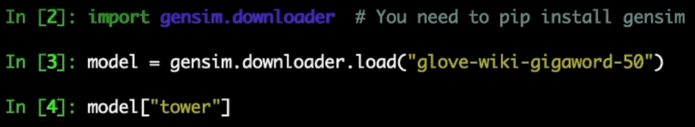

本文是下面视频的学习笔记

[原视频链接](https://www.youtube.com/watch?v=wjZofJX0v4M)

1. 注意力（Attention）的本质，就是要确定上下文中哪些词对更新其他词的意义有关，以及如何准确地更新这些含义（meaning）
2. 这里的含义（meaning）完全是通过向量来表示的

3. 关键思想在于，模型在训练过程中微调权重，以确定词如何被嵌入为向量，它会倾向于找到一组嵌入，使得这个空间中的方向含有特定的语义意义。

视频博主制作动画的Python库：

