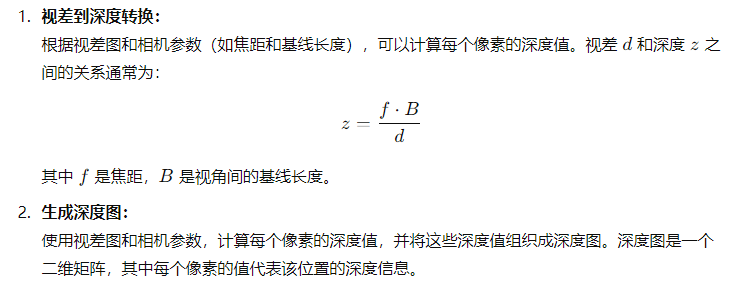

## 光场

光场图像是通过多个视角的图像组成的，通常是一个二维数组，其中每个元素是一个图像。这些二维图像是行列对齐的，每个图像都对应一个不同的视角（在 `u` 和 `v` 维度上）。

从数据的角度直观来看，就是维度是`u v h w c`的多维图像，其中`u v`表示角度分辨率，`h w`表示空间分辨率。

## 光场的视角warp

光场图像的视角 **warp**（变换）是指通过改变观察点（视角）来重建光场图像的不同视角。这通常通过光场图像中的视差信息来实现，目的是从给定的视角重建新的视角图像。

视角 warp 基本原理是通过对原始图像应用视差（或光流）信息，**在不同视角之间进行像素的重新定位或插值**。这相当于在给定的视差图的指导下，将光场图像从一个视角“扭曲”到另一个视角。

### 视差和深度的关系

1. 视差图 `disparity` 表示场景中每个像素在不同视角下的深度变化。视差越大，表示物体离观察者越近，视差越小则表示物体远离观察者
2. 视差和深度成反比



**视角 Warp 过程**

1. **获取视差图**：从源视角的图像中获取视差图（如果没有视差图，可以使用光流估计算法生成）。
2. **计算像素偏移**：根据视差图中的每个像素值计算对应的偏移量。视差图中的每个像素的值表示该位置的深度差，进而影响视角变换时该位置的偏移量。
3. **应用偏移**：根据计算得到的偏移量，将原始图像中的每个像素映射到新的视角位置。这一步是最关键的，它可以通过将每个像素按照偏移量“拉伸”或“压缩”到新的位置来实现。
4. **插值填充**：由于变换后的图像可能没有精确的像素对齐，因此需要使用插值方法填充空缺区域，确保图像平滑。

### 数学公式

假设原始光场图像为 `I(u, v, x, y)`，其中`u,v` 是视角索引，`x, y`是图像的空间坐标。视差图为`D(u,v,x,y)`，表示每个像素的视差。

1. **视差偏移公式**：

   假设我们想要根据视差图将图像从视角`(u,v)`变换到视角`(u′,v′)`，则每个像素的新的位置可以通过以下公式计算：
   $$
   x′=x−D(u,v,x,y) \cdot \Delta u
   $$

   $$
   y′=y−D(u,v,x,y) \cdot \Delta v
   $$

   其中 $\Delta u$ 和 $\Delta v$ 是视角之间的差异。

2. **插值**： 由于视角变换可能导致某些像素点位置不再落在原始图像的网格上，因此需要使用插值方法（如双线性插值）来确定新的像素值：
   $$
   I(u′,v′,x′,y′) \approx \text{Interp}(I(u, v, x, y), x', y')
   $$

### 代码实现

**视角 Warp 的常见方法**

1. **基于视差的像素映射**：根据视差图计算像素的空间偏移，然后将原始图像的像素迁移到新位置。
2. **深度图和重投影**：基于场景的深度信息，通过投影变换将图像从一个视角“映射”到另一个视角。

下面是基于视差的像素映射的代码实现：

```python
def view_warp(lf, disparity):
    """
    视角 warp
    @param lf: light figures 光场图像 是一个多维张量
    @param disparity: 视差
    @return: warp后的光场图像
    """
    # warp LF with one specific disparity
    [batch, height_view, width_view, height, width, channel] = lf.shape

    # 将 lf 重新调整形状并转置，使其形状变为 [n*u*v, c, h, w]
    # n*u*v：是所有视图的总数（将 batch、height_view 和 width_view 展平）
    # permute：将维度重新排列
    lf_t = lf.reshape((-1, height, width, channel)).permute((0, 3, 1, 2))  # n*u*v,c,h,w

    # 计算视图中心点
    center_u = height_view // 2
    center_v = width_view // 2

    # 存储所有视图的窗格
    grid = []

    for u in range(height_view):
        for v in range(width_view):
            # 计算每个视图相对于中心视图的偏移量
            dispmap_u = -disparity * (u - center_u)
            dispmap_v = -disparity * (v - center_v)

            # 计算高度范围和宽度范围的坐标网格，并应用视差映射
            h_range = torch.arange(0, height).view(1, height, 1).expand(batch, height, width) + dispmap_u  # [n,h,w]
            w_range = torch.arange(0, width).view(1, 1, width).expand(batch, height, width) + dispmap_v

            # 将 h_range 和 w_range 归一化到 [-1, 1] 之间
            h_range = 2. * h_range / (height - 1) - 1
            w_range = 2. * w_range / (width - 1) - 1

            # 将 w_range 和 h_range 堆叠在一起，形成一个形状为 [n, h, w, 2] 的张量，并将其添加到 grid 列表中
            grid_t = torch.stack((w_range, h_range), dim=3)  # [n,h,w,2]
            grid.append(grid_t)

    # 将所有视图的变换网格连接在一起，形成一个形状为 [n*u*v, h, w, 2] 的大网格
    grid = torch.cat(grid, 0)  # [n*u*v,h,w,2]

    # 使用 grid_sample 函数根据变换网格对光场图像进行采样，生成 warp 后的光场图像。
    # grid_sample 按照网格的位置采样图像，生成新的视角图像。
    warped_lf = torch.nn.functional.grid_sample(lf_t, grid.type_as(lf_t), padding_mode="zeros", align_corners=True)

    # 将 warp 后的光场图像重新调整形状，使其形状变为 [n, u, v, h, w, c]，并将通道维度移动到最后一个维度
    warped_lf = warped_lf.reshape((batch, height_view, width_view, channel, height, width)).permute((0, 1, 2, 4, 5, 3))

    return warped_lf
```

