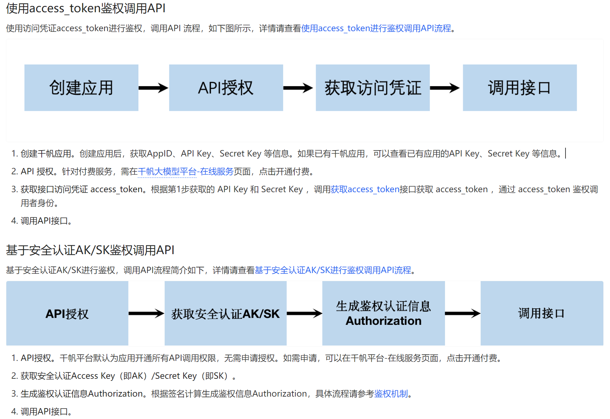

# 常见LLM Python SDK开发指南

## 前言

目前通过编程调用LLM（Large Language Model，大语言模型）的对话Chat、续写、图像等功能，一般都会有下面两种方式：HTTP调用API、SDK调用大模型，所有大模型的调用教程都可以在对应大模型官网的开发文档中找到

### HTTP调用API

用户向模型以网络请求的方式进行调用，用户发送调用请求，模型识别、响应请求并返回给用户。这种方式需要按照固定的请求格式，向固定网址发送请求进行调用，需要鉴权，鉴权也就是核验请求的账号信息，所以前提是需要有对应模型的账号，获取账号的身份信息（一般是API Key、Secret Key 等信息）进行鉴权。以百度千帆大模型为例，[鉴权方式](https://cloud.baidu.com/doc/WENXINWORKSHOP/s/yloieb01t)不同，调用API的方式也不同。



### SDK 调用

> SDK，Software Development Kit，软件开发工具包，为辅助开发某类软件而编写的特定软件包，框架集合等，一般包含相关文档，示例和工具，与API的概念区分开， API 是指应用编程接口，提供某项功能的调用接口，而基本的 SDK 通常由编译器、调试器和 API 组成）

SDK调用大模型就方便很多了（个人觉得），大模型SDK是大模型官方使用各种语言开发专门用来调用大模型的软件包，开发者可以在程序中直接导入使用，快捷地开发功能，提升开发效率，直白地说，就是调包，调包侠乐开花

至于有哪些语言的SDK，就得因模型而异了，不过绝大多数大模型都会有对应的Python SDK，毕竟Python易上手，用起来贼方便，下面分享的SDK 开发指南也是基于Python语言

## ChatGPT

ChatGPT API 获取：https://platform.openai.com/api-keys

官网SDK接口文档：https://platform.openai.com/docs/api-reference/introduction

### 一、设置 Python 环境

1. 电脑上有 Python 环境
2. 创建虚拟环境（可选）
3. 安装 ChatGPT SDK：openai

```shell
pip install --upgrade openai
```

### 二、设置 API key

1. 为所有项目一起设置 API key （环境变量）（官网推荐）

- 打开 cmd
- 输入命令`setx OPENAI_API_KEY "your-api-key-here"`进行全局设置（记的替换为自己的 API key）
- 如果要永久设置环境变量，则直接在本地环境变量中添加

1. 为单个项目设置 API key

如果您只希望单个项目可以访问您的API密钥，则可以创建一个包含API密钥的本地.env文件，然后将该API密钥与后续步骤中显示的Python代码一起显式使用

- 在项目目录下创建`.env`文件，然后在文件写入下面内容：

```shell
# Once you add your API key below, make sure to not share it with anyone! The API key should remain private.

OPENAI_API_KEY=abc123（替换成自己的API key）
```

- 在代码中导入`.env`文件中的 API key，其实是默认导入的，不用手动导入

```python
from openai import OpenAI

client = OpenAI()
# defaults to getting the key using os.environ.get("OPENAI_API_KEY")
# if you saved the key under a different environment variable name, you can do something like:
# client = OpenAI(
#   api_key=os.environ.get("CUSTOM_ENV_NAME"),
# )
```

### 三、发送请求

```shell
from openai import OpenAI
client = OpenAI()

completion = client.chat.completions.create(
  model="gpt-4o-mini",
  messages=[
    {"role": "system", "content": "You are a poetic assistant, skilled in explaining complex programming concepts with creative flair."},
    {"role": "user", "content": "你询问的问题"}
  ]
)

print(completion.choices[0].message)
```

## 文心一言

获取API Key、Secret Key、access_token：https://cloud.baidu.com/doc/WENXINWORKSHOP/s/Rlkkt6kd7

获取AK/SK：https://cloud.baidu.com/doc/Reference/s/9jwvz2egb

官网SDK接口文档（以ERNIE-4.0-8K模型为例）：https://cloud.baidu.com/doc/WENXINWORKSHOP/s/clntwmv7t

## 智谱清言

官网SDK接口文档：https://maas.aminer.cn/dev/api

获取API Key：https://maas.aminer.cn/usercenter/apikeys

## 科大讯飞

官网SDK接口文档：https://www.xfyun.cn/doc/spark/Web.html

## 通义千问

官网SDK接口文档：https://help.aliyun.com/zh/dashscope/developer-reference/use-qwen-by-api

获取API Key：https://dashscope.console.aliyun.com/apiKey