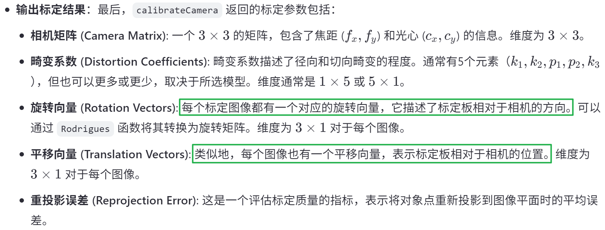
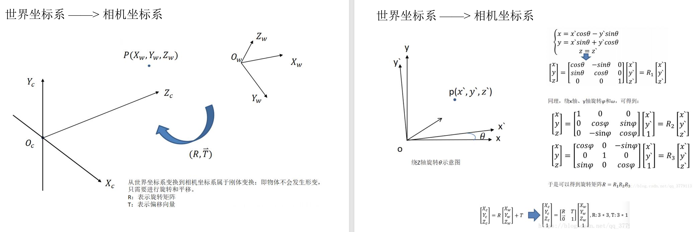
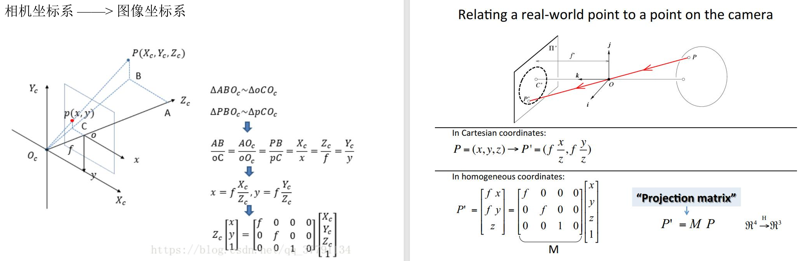
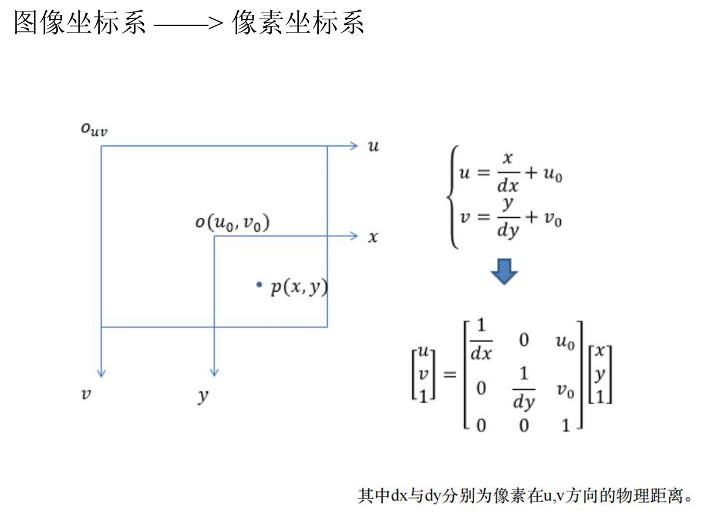
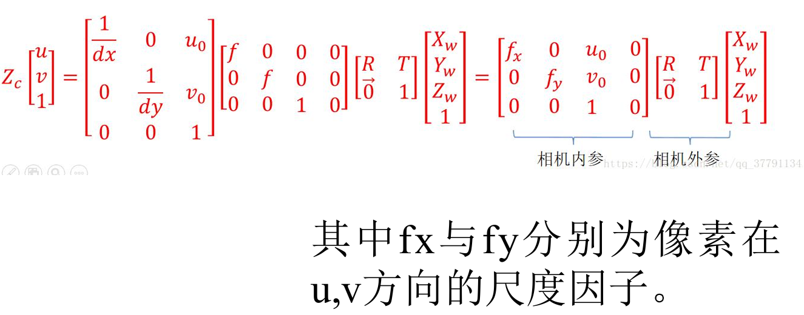
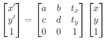
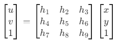
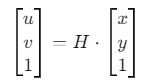

相机阵列知识点总结


## 相机阵列标定

> 相机阵列的标定其实本质上和单个相机的标定没太大区别，只是在拍摄时是以阵列的形式进行拍摄，标定的时候还是以相机为单位分别进行标定

### 1. 标定板拍摄

#### 1.1 选择合适的标定板

通常使用棋盘格标定板进行相机标定。棋盘格标定板的设计应确保有足够的特征点（角点），这些特征点用于计算相机的内外参。

- **棋盘格的尺寸**：通常选择9x6或10x7的棋盘格，具体取决于的相机阵列的视场。
- **棋盘格的格子大小**：需要根据的相机阵列的分辨率和视场大小来选择合适的格子大小，通常为2~3厘米的格子边长。

#### 1.2 设置相机阵列和标定板

1. **摆放标定板**：将标定板放置在多个不同的位置和角度下拍摄。每个相机拍摄标定板时，应保证标定板占据图像的较大部分，并且在整个相机阵列中，各个视角都有对标定板的观测。
   - **位置和角度**：尽量保证标定板在各个视角下的拍摄位置和角度有所不同，这样可以帮助提高标定精度。
   - **避免遮挡**：确保标定板不会被相邻的相机遮挡，并且每个相机的视角都能覆盖到标定板的多个角点。
2. **拍摄过程**：
   - 对每个相机进行拍摄，确保每个相机的图像都有清晰的标定板特征点。
   - 为了提高标定的精度，建议拍摄时每个相机的视角有所变化，覆盖不同的深度和位置。

#### 1.3 标定板图像的采集

- 在不同的位置和角度拍摄多张标定板图像。每个相机至少需要拍摄10张不同视角的标定板图像。
- 每个相机拍摄时，应记录每张图像的拍摄位置（相机位置和姿态），这些信息将在后期的标定过程中使用。

### 2. 相机阵列标定过程

#### 2.1 提取角点

> （使用OpenCV的`findChessboardCorners`）

- 对于每个相机的图像，使用OpenCV的`findChessboardCorners`函数提取标定板上的角点。这个步骤可以帮助确定标定板上每个格子的实际位置。

```python
import cv2
import numpy as np

# 假设已有标定板图像
image = cv2.imread('chessboard_image.jpg')
gray = cv2.cvtColor(image, cv2.COLOR_BGR2GRAY)

# 设置棋盘格的内角点数量
chessboard_size = (9, 6)

# 查找角点
ret, corners = cv2.findChessboardCorners(gray, chessboard_size, None)

if ret:
    # 提取角点
    cv2.drawChessboardCorners(image, chessboard_size, corners, ret)
    cv2.imshow('Chessboard Corners', image)
    cv2.waitKey(0)
    cv2.destroyAllWindows()
else:
    print("Corners not found")
```

- 如果找到角点，可以将这些角点在图像中显示出来，并进行下一步标定。

#### 2.2 标定过程

> 计算相机的内参和外参

使用多个标定图像（每个视角的标定板图像）来计算相机的内参和外参。

1. **内参**：包括相机的焦距（fx, fy）、主点（cx, cy）和畸变系数（k1, k2, p1, p2）。
2. **外参**：包括相机的位置和朝向（旋转矩阵R和平移向量T）。

```python
# 假设标定板每个格子的实际尺寸是 30mm
square_size = 0.03  # 单位是米

# 3D点的世界坐标系（假设标定板位于z=0的平面）
obj_points = []
img_points = []

# 假设标定板角点的数量是9x6
obj_point = np.zeros((chessboard_size[0] * chessboard_size[1], 3), np.float32)
obj_point[:, :2] = np.indices(chessboard_size).T.reshape(-1, 2)
obj_point *= square_size  # 按照标定板格子尺寸进行缩放

# 假设有多个图像，提取角点后将其添加到img_points列表
img_points.append(corners)  # corners为从findChessboardCorners函数获取的角点
obj_points.append(obj_point)

# 相机标定
ret, camera_matrix, dist_coeffs, rvecs, tvecs = cv2.calibrateCamera(obj_points, img_points, gray.shape[::-1], None, None)

# 打印标定结果
print("Camera Matrix:\n", camera_matrix)
print("Distortion Coefficients:\n", dist_coeffs)
```

在标定的过程中，`cv2.calibrateCamera`会计算相机的内参（`camera_matrix`）和畸变系数（`dist_coeffs`），并为每个图像计算出相机的外参（旋转向量`rvecs`和平移向量`tvecs`）。

#### 2.3 计算相机阵列的外参

如果有多个相机，接下来需要进行相机阵列的标定。可以通过匹配不同相机拍摄到的标定板图像来计算相机之间的相对变换（即相对位置和姿态）。使用`cv2.stereoCalibrate`或者`cv2.calibrateCamera`来完成这一过程。

```python
# 假设已经获得了两个相机的角点图像和3D世界坐标系中的角点
# 使用`cv2.stereoCalibrate`来计算相机之间的相对旋转和平移
ret, camera_matrix1, dist_coeffs1, camera_matrix2, dist_coeffs2, R, T, E, F = cv2.stereoCalibrate(
    obj_points, img_points1, img_points2, camera_matrix1, dist_coeffs1, camera_matrix2, dist_coeffs2, gray.shape[::-1], criteria, flags
)

print("Rotation Matrix (R):\n", R)
print("Translation Vector (T):\n", T)
```

- **`R`** 是旋转矩阵，表示从一个相机坐标系到另一个相机坐标系的旋转。
- **`T`** 是平移向量，表示两个相机之间的平移。

#### 2.4 校正畸变

在标定过程中，还需要进行畸变校正，以便从畸变图像中恢复出真实图像。可以使用`cv2.undistort`函数进行图像的畸变校正：

```python
# 对图像进行畸变校正
undistorted_img = cv2.undistort(image, camera_matrix, dist_coeffs)
cv2.imshow('Undistorted Image', undistorted_img)
cv2.waitKey(0)
cv2.destroyAllWindows()
```

### 3. 结果分析与应用

1. **内参**（相机矩阵）：对于每个相机，将获得其内参矩阵（焦距、主点坐标）和畸变系数。这些参数可以用于后续的图像处理，如去畸变或深度估计。
2. **外参**（旋转矩阵和平移向量）：对于相机阵列的标定，外参矩阵表示相机之间的相对位置和姿态。通过这些参数，可以计算出各相机之间的相对变换，用于图像对齐。

标定函数`cv2.calibrateCamera`输出结果：




## 相机内参外参

### 相机内参

> （不随位置变化）

相机的内参是固定的，**不会随着相机位置的变化而改变**。内参包括：

- **焦距（f）**：决定了相机的视场大小。
- **主点（cx, cy）**：图像坐标系原点的位置，通常接近图像的中心。
- **畸变系数**：表示镜头引起的畸变（如径向畸变和切向畸变）。

这些内参描述了相机的光学属性，它们与相机的位置和方向无关。因此，无论相机在空间中如何移动，只要相机的镜头、传感器等硬件不发生变化，内参就不需要重新计算。

也就是说，相机内参经过标定之后可以重复使用，除非相机本身硬件发生变化（如焦距）。

### 相机外参

> （会随着位置变化而变化）

相机的外参描述了相机相对于世界坐标系或其他相机坐标系的**位置和姿态（即旋转和平移）**，它们会随着相机位置的变化而变化。

- **旋转矩阵（R）**：描述相机坐标系与世界坐标系之间的旋转关系。
- **平移向量（T）**：描述相机坐标系原点相对于世界坐标系原点的平移量。

如果移动了相机的位置，或者改变了相机的朝向，那么它的外参（旋转矩阵和平移向量）就会发生变化。

**举例**：

- **内参**：比如，假设使用的是一个固定的相机，焦距和主点位置是由相机的光学设计决定的，除非更换镜头或进行其他硬件更改，否则这些参数始终不变。
- **外参**：如果将相机从一个位置移动到另一个位置，或者改变其角度，外参就会发生变化。例如，如果从一个房间的一角移动到另一个角落，或者将相机从水平位置旋转到垂直位置，那么相机的外参（旋转和平移）会改变。

因此，在实际应用中，如果相机的位置或朝向发生变化，需要重新计算相机的外参，但内参保持不变。

## LF对齐

一个相机阵列拍摄的一副场景图像（称为raw_LF）肯定是存在baseline、水平和垂直等方向的误差的，因此需要对raw_LF进行对齐，保证不同视角之间的baseline一致，并且每行每列的视图是对齐的，对齐的方式就是`单应变换`


## 坐标系转换

相机模型中的四个坐标系：

1. 世界坐标系：描述相机位置，单位：m

   它是一个固定的全局坐标系，通常是相机所在的环境坐标系，定义了场景中物体的位置。

2. 相机坐标系：相机的光心为原点，单位：m

   通常，**相机坐标系的 Z 轴指向相机的视线方向**，**X 和 Y 轴平行于图像平面**。

3. 图像坐标系：原点为成像平面的中心，单位：mm

   表示图像中的像素位置，通常以二维坐标表示。

4. 像素坐标系：原点为图像的左上角像素的位置，单位：pixel

   原点通常位于图像的左上角，x 轴从左到右，y 轴从上到下。

> **像素坐标系** 实际上只是 **图像坐标系** 的一个离散版本，用来表示图像中实际的像素位置。在数字图像中，像素坐标是整数值，因此它们是离散的，而图像坐标系是连续的。

### 世界坐标系 → 相机坐标系

通过外参矩阵来进行转换，通常需要旋转矩阵和位移向量 [R∣T]。外参矩阵通常是一个 3x4 的矩阵，其中R是3×3的旋转矩阵，T是3×1的平移矩阵。



### 相机坐标系 → 图像坐标系

通过相机的内参矩阵来将相机坐标系中的三维点投影到图像坐标系的二维点。这个过程本质上是透视投影。



### 图像坐标系 → 像素坐标系



### 世界坐标系 → 像素坐标系




### 仿射、透视、单应变换

（1）**仿射变换 (Affine Transformation)**

仿射变换是一种保持点之间的直线性和平行性的变换，应用于图像或几何形状时，它保持了点之间的相对位置和角度，但可以进行平移、旋转、缩放和剪切等操作。仿射变换可以通过一个 2x3 的矩阵表示：



仿射变换包括平移、旋转、缩放等，但不涉及透视变换，因此它不考虑深度信息或视角的变化。

（2） **透视变换 (Perspective Transformation)**

透视变换是一种将三维场景的点映射到二维图像平面的变换，它考虑了深度信息和视角的变化。透视变换通常使用一个 3x3 的矩阵表示，即单应性矩阵。透视变换的数学表示为：



透视变换会使直线仍然保持直线，但会引入深度变化。它用于图像配准、全景拼接等任务中。

OpenCV透视变换的函数`warpPerspective`

（3）**单应变换 (Homography Transformation)**

单应性变换是透视变换的一种特殊情况，主要用于将一个平面上的点映射到另一个平面上。它使用一个 3x3 的矩阵来表示，适用于相机视角的变化，例如将图像中的某个平面映射到另一个视角的平面上。

数学上，单应性变换可以通过一个 3x3 的矩阵 H 表示，表示从一个图像坐标系到另一个图像坐标系的透视变换。



单应性变换广泛用于图像配准和全景图像拼接等应用中。